# Use Harbor in Azure and Multi-Cloud Environments

In today's rapidly evolving cloud landscape, managing container images in a single-cloud scenario across multiple regions or across multiple cloud providers can be a complex and challenging task. However, with the introduction of [Harbor](https://goharbor.io/), an open-source, cloud-native registry, customers can now enjoy a unified and efficient approach to container image management across separate cloud environments such as Azure, AWS, and GCP.

Harbor was created to address the growing need for a single source of truth in container image management. Initially developed by VMware, it has gained popularity within the cloud-native community due to its powerful features and ease of use. As an open-source project, Harbor benefits from the collective efforts of a vibrant community, ensuring continuous improvements and innovation.

Harbor's significance to the cloud-native ecosystem is further amplified by its acceptance as a [graduated member project](https://www.cncf.io/projects/harbor/) of the [Cloud Native Computing Foundation (CNCF)](https://www.cncf.io/). This prestigious recognition highlights the project's maturity and adherence to industry best practices.

One of the key advantages of adopting Harbor is its robust security capabilities. The registry incorporates features like vulnerability scanning and access controls, ensuring that container images are thoroughly examined for vulnerabilities using Trivy before deployment. [Trivy](https://trivy.dev/) is a popular open source security scanner, reliable, fast, and easy to use. Furthermore, [Harbor](https://goharbor.io/) allows customers to enforce consistent security policies and granular access controls, granting authorized users or teams exclusive rights to container images. This enhanced security posture allows customers to maintain control over their container images in a multi-cloud environment, mitigating potential security risks.

This article provides a comprehensive guide on deploying [Harbor](https://goharbor.io/) on [Azure Kubernetes Service (AKS)](https://learn.microsoft.com/en-us/azure/aks/intro-kubernetes) in a reliable and secure manner, leveraging various configurations and network topologies. It also explains how to replicate container images across multiple registries and cloud environments, integrating Harbor with [Azure Container Registry (ACR)](https://azure.microsoft.com/en-us/services/container-registry/). Additionally, it discusses the integration of Harbor into a consistent GitOps and DevOps CI/CD strategy using [Argo CD](https://argo-cd.readthedocs.io/en/stable/),  [Flux CD](https://fluxcd.io/), and [Azure DevOps](https://learn.microsoft.com/en-us/azure/devops/user-guide/what-is-azure-devops?view=azure-devops).

## Table of Contents

- [Use Harbor in Azure and Multi-Cloud Environments](#use-harbor-in-azure-and-multi-cloud-environments)
  - [Table of Contents](#table-of-contents)
  - [Repository Structure](#repository-structure)
  - [Harbor Services](#harbor-services)
  - [Deploying Harbor on AKS with Helm](#deploying-harbor-on-aks-with-helm)
    - [Deploy Harbor with Managed Disks](#deploy-harbor-with-managed-disks)
    - [Deploy Harbor with Managed PostgreSQL and Redis](#deploy-harbor-with-managed-postgresql-and-redis)
    - [Deploy Harbor across Availability Zones](#deploy-harbor-across-availability-zones)
      - [Create an AKS cluster across availability zones](#create-an-aks-cluster-across-availability-zones)
      - [Spread Pods across Zones using Pod Topology Spread Constraints](#spread-pods-across-zones-using-pod-topology-spread-constraints)
      - [Custom ZRS Storage Classes](#custom-zrs-storage-classes)
      - [Harbor with ZRS Azure Files and Managed Disks](#harbor-with-zrs-azure-files-and-managed-disks)
  - [Network Topologies in Azure](#network-topologies-in-azure)
    - [Harbor Instances communicating via Public IP Address](#harbor-instances-communicating-via-public-ip-address)
    - [Harbor Instances communicating via Private IP Address](#harbor-instances-communicating-via-private-ip-address)
    - [Harbor Instances communicating via Azure Private Link](#harbor-instances-communicating-via-azure-private-link)
  - [Working with Harbor](#working-with-harbor)
  - [Create a New Project](#create-a-new-project)
  - [Create a New User](#create-a-new-user)
  - [Working with Images in Harbor](#working-with-images-in-harbor)
    - [Pushing Images to Harbor](#pushing-images-to-harbor)
    - [Pulling Images from Harbor](#pulling-images-from-harbor)
    - [Using an Image from Harbor](#using-an-image-from-harbor)
      - [Log in to Harbor](#log-in-to-harbor)
      - [Create a Secret based on existing credentials](#create-a-secret-based-on-existing-credentials)
      - [Create a Secret by providing credentials on the command line](#create-a-secret-by-providing-credentials-on-the-command-line)
      - [Inspecting the `regcred` Secret](#inspecting-the-regcred-secret)
      - [Create a Deployment that uses a Harbor image](#create-a-deployment-that-uses-a-harbor-image)
  - [Create a Registry Endpoint in Harbor](#create-a-registry-endpoint-in-harbor)
    - [Create a Registry Endpoint to another Harbor Instance](#create-a-registry-endpoint-to-another-harbor-instance)
    - [Create a Registry Endpoint to Docker Hub](#create-a-registry-endpoint-to-docker-hub)
    - [Create a Registry Endpoint to Azure Container Registry (ACR)](#create-a-registry-endpoint-to-azure-container-registry-acr)
  - [Create a Replication Rule](#create-a-replication-rule)
    - [Create a Pull Replication Rule from Docker Hub](#create-a-pull-replication-rule-from-docker-hub)
    - [Create a Pull Replication Rule from another Harbor Instance](#create-a-pull-replication-rule-from-another-harbor-instance)
    - [Create a Pull Replication Rule from Azure Container Registry (ACR)](#create-a-pull-replication-rule-from-azure-container-registry-acr)
    - [Create a Push Replication Rule to Azure Container Registry (ACR)](#create-a-push-replication-rule-to-azure-container-registry-acr)
  - [Import Images into Azure Container Registry (ACR) from Harbor](#import-images-into-azure-container-registry-acr-from-harbor)
  - [Use Trivy to scan an Image for Vulnerabilities](#use-trivy-to-scan-an-image-for-vulnerabilities)
  - [Configure Harbor Replication Rules using Terraform](#configure-harbor-replication-rules-using-terraform)
    - [Resources](#resources)
    - [Authentication](#authentication)
    - [Argument Reference](#argument-reference)
    - [Links](#links)
  - [Using Harbor in CI/CD](#using-harbor-in-cicd)
    - [GitOps and DevOps](#gitops-and-devops)
    - [Harbor Integration in CI/CD Workflows](#harbor-integration-in-cicd-workflows)
    - [Using Harbor with Argo CD](#using-harbor-with-argo-cd)
    - [Using Harbor with Flux](#using-harbor-with-flux)
    - [Using Harbor with Azure DevOps](#using-harbor-with-azure-devops)
  - [Using Harbor in multi-cloud scenario](#using-harbor-in-multi-cloud-scenario)
  - [Conclusion](#conclusion)
  - [Acknowledgements](#acknowledgements)

## Repository Structure

The following table contains the repository structure.

```text
└── use-harbor-with-aks-and-acr-azure-sample
    └── CHANGELOG.md                                     - Change log
    └── CONTRIBUTING.md                                  - Contributing rules
    └── images                                           - Images
        └── aks-architecture.png
        └── argo-cd.png
        └── azure-devops.png
        └── deployment-with-azure-files.png
        └── deployment-with-managed-disks.png
        └── deployment-with-managed-sql-and-redis.png
        └── destination.png
        └── flux-cd.png
        └── hover-the-mouse.png
        └── members-after.png
        └── members-before.png
        └── multi-attach-error.png
        └── multi-cloud.png
        └── new-acr-endpoint.png
        └── new-docker-hub-endpoint.png
        └── new-harbor-endpoint.png
        └── new-project-member.png
        └── new-project.png
        └── new-user.png
        └── not-scanned.png
        └── private-link-service.png
        └── private-load-balancer.png
        └── projects-after-project-creation.png
        └── projects-before-project-creation.png
        └── providers.png
        └── public-load-balancer.png
        └── pull-flaskapp-image-from-another-harbor.png
        └── pull-image.png
        └── pull-images-from-acr.png
        └── pull-ubuntu-latest-replication-rule.png
        └── push-image-to-acr.png
        └── push-image.png
        └── push-or-pull.png
        └── rbac.png
        └── registries.png
        └── replications.png
        └── set-user-as-admin.png
        └── source-resource-filter.png
        └── token-scope-map-concepts.png
        └── trigger-mode.png
        └── vulnerabilities.png
    └── LICENSE.md                                       - License
    └── README.md                                        - Readme
    └── scripts                                          - Scripts and YAML manifests
        └── 00-variables.sh
        └── 01-create-nginx-ingress-controller.sh
        └── 02-install-cert-manager.sh
        └── 03-deploy-harbor-with-managed-disks.sh
        └── 04-deploy-harbor-with-managed-services.sh
        └── 05-deploy-harbor-via-helm-across-azs.sh
        └── 06-configure-dns-record.sh
        └── 07-build-docker-image.sh
        └── 08-run-docker-container.sh
        └── 09-push-docker-image.sh
        └── 10-deploy-app.sh
        └── 11-configure-dns.sh
        └── 12-create-acr.sh
        └── 13-get-acr-token.sh
        └── 14-add-repository-to-scope-map.sh
        └── 15-import-image-from-harbor-into-acr.sh
        └── app                                          - Sample Python application
            └── Dockerfile
            └── requirements.txt
            └── src
                └── app.py
                └── templates
                    └── error.html
                    └── index.html
        └── azurefile-csi-premium-zrs.yml
        └── cluster-issuer.yml
        └── deployment.yml
        └── ingress.yml
        └── managed-csi-premium-zrs.yml
        └── pvc.yml
        └── service.yml
    └── visio
        └── architecture.vsdx                            - Visio file with diagrams
```

## Harbor Services

When installing Harbor, you will encounter seven services that play different roles in the registry:

- `Core`: The Core service is the main component of Harbor. It manages the overall functionality and operation of the Harbor registry. This service runs in its own pod.
- `Portal`: The Portal service provides the user interface for interacting with Harbor. It allows users to browse, search, and manage container images and projects. The Portal service runs in its own pod.
- `Job Service`: The Job Service manages and executes background tasks in Harbor. It handles tasks such as garbage collection, replication, and scanning. This service ensures that these tasks run in the background without affecting the responsiveness of the registry. The Job Service runs in its own pod.
- `Registry`: The Registry service is the core component of Harbor. It handles the storage and retrieval of container images. This service is compatible with the Docker Registry HTTP API V2 specifications. The Registry service runs in its own pod.
- `Redis`: Redis is an in-memory data structure store that acts as a key-value cache for Harbor. It improves the performance of the registry by storing frequently accessed data in memory, reducing the need for disk I/O operations. The Redis service runs in its own pod.
- `Database`: The Database service is responsible for storing and managing metadata and configuration of Harbor. It holds information such as users, projects, repositories, access control policies, and system settings. Harbor supports different databases like PostgreSQL and MySQL. The Database service ensures the persistence and integrity of the registry data.
- `Trivy`: Trivy is a vulnerability scanner integrated with Harbor. It scans container images for security vulnerabilities during the image push process. Trivy runs in a separate pod and interacts with the Database and Registry services. It adds an additional layer of security by automatically scanning container images for vulnerabilities.

Each service operates within its own deployment, which can consist of one or multiple pods, depending on the specified deployment configuration. For more information on Harbor installation, see the following resources:

- [Test Harbor with the Demo Server](https://goharbor.io/docs/2.1.0/install-config/demo-server/)
- [Harbor Compatibility List](https://goharbor.io/docs/2.1.0/install-config/harbor-compatibility-list/)
- [Harbor Installation Prerequisites](https://goharbor.io/docs/2.1.0/install-config/installation-prereqs/)
- [Download the Harbor Installer](https://goharbor.io/docs/2.1.0/install-config/download-installer/)
- [Configure HTTPS Access to Harbor](https://goharbor.io/docs/2.1.0/install-config/configure-https/)
- [Configure Internal TLS communication between Harbor Component](https://goharbor.io/docs/2.1.0/install-config/configure-internal-tls/)
- [Configure the Harbor YML File](https://goharbor.io/docs/2.1.0/install-config/configure-yml-file/)
- [Run the Installer Script](https://goharbor.io/docs/2.1.0/install-config/run-installer-script/)
- [Deploying Harbor with High Availability via Helm](https://goharbor.io/docs/2.1.0/install-config/harbor-ha-helm/)
- [Deploy Harbor with the Quick Installation Script](https://goharbor.io/docs/2.1.0/install-config/quick-install-script/)
- [Troubleshooting Harbor Installation](https://goharbor.io/docs/2.1.0/install-config/troubleshoot-installation/)
- [Reconfigure Harbor and Manage the Harbor Lifecycle](https://goharbor.io/docs/2.1.0/install-config/reconfigure-manage-lifecycle/)
- [Customize the Harbor Token Service](https://goharbor.io/docs/2.1.0/install-config/customize-token-service/)
- [Configure Harbor User Settings at the Command Line](https://goharbor.io/docs/2.1.0/install-config/configure-user-settings-cli/)

## Deploying Harbor on AKS with Helm

Deploying Harbor on [Azure Kubernetes Service (AKS)](https://learn.microsoft.com/en-us/azure/aks/intro-kubernetes) can be done reliably using [Helm](https://helm.sh/). By leveraging Helm, you can easily set up Harbor on your AKS environment. One option is to use the official [Harbor Helm chart](https://github.com/goharbor/harbor-helm), which is also available on [Artifact Hub](https://artifacthub.io/packages/helm/harbor/harbor). For detailed instructions on customizing the deployment, refer to the [Harbor Helm chart GitHub repository](https://github.com/goharbor/harbor-helm). Alternatively, you can explore alternative Helm charts supported by the technical community or third-party providers like [Bitnami](https://artifacthub.io/packages/helm/bitnami/harbor). These alternative charts offer additional features and customization options.

This article offers a collection of scripts that enable the deployment of Harbor on AKS through Helm, providing alternative configurations for seamless container image management in your AKS environment. Before executing any script, it is essential to customize the variables within the `00-variables.sh` file. his file is integrated into all the scripts and contains the following variables:

```bash
#!/bin/bash

# Azure Subscription and Tenant
subscriptionId=$(az account show --query id --output tsv)
subscriptionName=$(az account show --query name --output tsv)
tenantId=$(az account show --query tenantId --output tsv)
harborResourceGroupName="MikiRG"
location="eastus2"

# Harbor
harborNamespace="harbor"
harborRepoName="harbor"
harborChartName="harbor"
harborReleaseName="harbor"
harborRepoUrl="https://helm.goharbor.io"
harborTlsSecretName="harbor-tls"
harborIngressClassName="nginx"
harborExposeType="ingress"
harborRegistryStorageClass="managed-csi-premium"
harborAdminUsername="admin"
harborAdminPassword="admin"

# Store size
registrySize="256Gi"
jobserviceJobLogSize="8Gi"
databaseSize="8Gi"
redisSize="8Gi"
trivySize="8Gi"

# Replica Count
portalReplicaCount=1
coreReaplicaCount=1
jobserviceReplicaCount=1
registryReplicaCount=1
trivyReplicaCount=1

# Certificate Manager
certManagerNamespace="cert-manager"
certManagerRepoName="jetstack"
certManagerRepoUrl="https://charts.jetstack.io"
certManagerChartName="cert-manager"
certManagerReleaseName="cert-manager"
certManagerClusterIssuer="letsencrypt-nginx"
certManagerAcmeChallengeType="http01"
email="paolos@contoso.com"
clusterIssuer="letsencrypt-nginx"
template="cluster-issuer.yml"

# NGINX Ingress Controller
nginxNamespace="ingress-basic"
nginxRepoName="ingress-nginx"
nginxRepoUrl="https://kubernetes.github.io/ingress-nginx"
nginxChartName="ingress-nginx"
nginxReleaseName="nginx-ingress"
nginxIngressClassName="nginx"
nginxReplicaCount=3

# Azure DNS Zone
dnsZoneName="contoso.com"
dnsZoneResourceGroupName="dnsresourcegroup"
harborSubdomain="harbor"
harborHostname="${harborSubdomain,,}.${dnsZoneName,,}"
sampleSubdomain="flaskapp"
sampleHostname="${sampleSubdomain,,}.${dnsZoneName,,}"

# Virtual Network
virtualNetworkName="MikiAksVnet"
virtualNetworkAddressPrefix="10.0.0.0/8"

# Subnets
postgreSqlSubnetName="SqlSubnet"
postgreSqlSubnetPrefix="10.244.0.0/24"
defaultSubnetName="VmSubnet"
defaultPrefix="10.243.1.0/24"

# Private DNS Zones
postgreSqlPrivateDnsZoneName="harbor.postgres.database.azure.com"
postgreSqlPrivateDnsZoneVirtualNetworkLinkName="LinkTo${virtualNetworkName}"
redisPrivateDnsZoneName="privatelink.redis.cache.windows.net"
redisPrivateDnsZoneVirtualNetworkLinkName="LinkTo${virtualNetworkName}"

# Azure Database for PostgreSQL flexible server
postgreSqlServerName="MikiPostgreSQLServer"
postgreSqlActiveDirectoryAuth="Enabled"
postgreSqlAdminUsername="azadmin"
postgreSqlAdminPassword="P@ssw0rd1234"
postgreSqlSkuName="Standard_D2s_v3"
postgreSqlStorageSize=1024
postgreSqlVersion=15
postgreSqlDatabaseName="registry"

# Azure Cache for Redis
redisCacheName="MikiRedisCache"
redisCacheSku="Standard"
redisCacheVmSize="C1"
redisCachePrivateEndpointName="RedisCachePrivateEndpoint"
redisCachePrivateDnsZoneGroupName="RedisCache"

# Azure Container Registry
acrName="TanAcr"
acrResourceGroupName="TanRG"
acrSku="Standard"
acrUsername="harbor"
acrScopeMapName="harbor-scope-map"
repositories=("chat" "doc")
moreRepositories=("harbor/flaskapp")
importProject="private"
importRepositories=("ubuntu:latest" "python:latest")

# Image
imageName="flaskapp"
tag="1.0"
harborProject="private"
imagePullPolicy="IfNotPresent" # Always, Never, IfNotPresent

# Others
dockerEmail="paolos@contoso.com"

# Kubernetes
sampleNamespace="flaskapp"
managedCsiPremiumZrsStorageClassName="managed-csi-premium-zrs"
azureFilePremiumZrsStorageClassName="azurefile-csi-premium-zrs"
```

This article presents three different deployment options:

- **Deploy Harbor with Managed Disks**: This is a basic installation option where all Harbor services utilize an [Azure Managed Disk](https://learn.microsoft.com/en-us/azure/virtual-machines/disks-types) as a data repository. Each service deployment consists of a single pod. This deployment is suitable for small setups.
- **Deploy Harbor with Managed PostgreSQL and Redis**: This deployment option creates and utilizes an [Azure Database for PostgreSQL flexible server](https://learn.microsoft.com/en-us/azure/postgresql/flexible-server/overview) as the data repository for the `database` service. It also employs an [Azure Cache for Redis](https://learn.microsoft.com/en-us/azure/azure-cache-for-redis/cache-overview), ideally configured with [zone redundancy](https://learn.microsoft.com/en-us/azure/azure-cache-for-redis/cache-how-to-zone-redundancy), as a cache for the `redis` service. This deployment is more robust than the previous option as it leverages the resiliency features provided by Azure managed services.
- **Deploy Harbor across Availability Zones**: This deployment option ensures intra-region resiliency by spreading multiple replicas of each service deployment across availability zones in a zone-redundant AKS cluster. Additionally, services utilize Zone Redundant Storage (ZRS) for persistent volumes.

Choose the deployment style that best fits your constraints and requirements in terms of reliability, configuration, performance, and cost. You can customize your own deployment configuration by selecting different values during the Helm chart deployment and by combining the approaches mentioned above.

### Deploy Harbor with Managed Disks

You can use the `03-deploy-harbor-with-managed-disks.sh` script to deploy Harbor to your Azure Kubernetes Service (AKS) cluster with a configuration illustrated in the following picture.

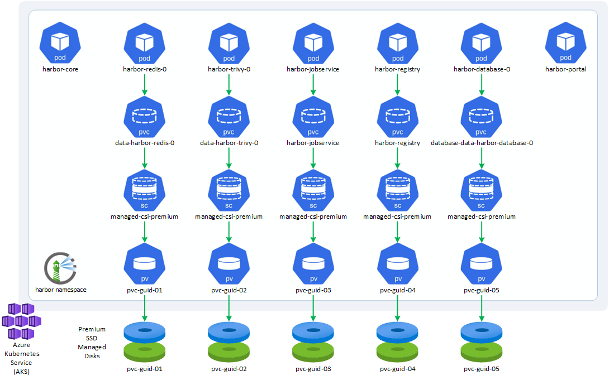

As it can be noticed, the `Redis`, `Trivy`, `Job Service`, `Registry`, and `Database` services utilize an [Azure Managed Disk](https://learn.microsoft.com/en-us/azure/virtual-machines/disks-types) as a persistent volume for data storage. These managed disks are created by the AKS cluster identity within the node resource group, which houses the resources associated with the cluster. The [Azure Disks CSI Driver](https://learn.microsoft.com/en-us/azure/aks/azure-disk-csi) is a CSI specification-compliant driver used by Azure Kubernetes Service (AKS) to manage the lifecycle of Azure managed Disks. The [Container Storage Interface (CSI)](<https://github.com/container-storage-interface/spec/blob/master/spec.md>) is a standard for exposing arbitrary block and file storage systems to containerized workloads on Kubernetes. For more information, see [Use the Azure Disk CSI Driver](https://learn.microsoft.com/en-us/azure/aks/azure-disk-csi).

```bash
#!/bin/bash

# Variables
source ./00-variables.sh

# Check if the Harbor repository is not already added
result=$(helm repo list | grep $harborRepoName | awk '{print $1}')

if [[ -n $result ]]; then
  echo "[$harborRepoName] Helm repo already exists"
else
  # Add the ingress-Harbor repository
  echo "Adding [$harborRepoName] Helm repo..."
  helm repo add $harborRepoName $harborRepoUrl
fi

# Update your local Helm chart repository cache
echo 'Updating Helm repos...'
helm repo update

# Use Helm to deploy Harbor
result=$(helm list -n $harborNamespace | grep $harborReleaseName | awk '{print $1}')

if [[ -n $result ]]; then
  echo "[$harborReleaseName] release already exists in the [$harborNamespace] namespace"

  # Upgrade Harbor
  echo "Upgrading [$harborReleaseName] release in the [$harborNamespace] namespace..."
  helm upgrade $harborReleaseName $harborRepoName/$harborChartName \
    --install \
    --create-namespace \
    --namespace $harborNamespace \
    --set externalURL=https://$harborHostname \
    --set harborAdminPassword=$harborAdminPassword \
    --set expose.type=$harborExposeType \
    --set expose.tls.certSource=secret \
    --set expose.tls.secret.secretName=$harborTlsSecretName \
    --set expose.ingress.hosts.core=$harborHostname \
    --set expose.ingress.className=$nginxIngressClassName \
    --set expose.ingress.annotations."cert-manager\.io/cluster-issuer"=$certManagerClusterIssuer \
    --set expose.ingress.annotations."cert-manager\.io/acme-challenge-type"=$certManagerAcmeChallengeType \
    --set persistence.enabled=true \
    --set persistence.persistentVolumeClaim.registry.storageClass=$harborRegistryStorageClass \
    --set persistence.persistentVolumeClaim.jobservice.jobLog.storageClass=$harborRegistryStorageClass \
    --set persistence.persistentVolumeClaim.database.storageClass=$harborRegistryStorageClass \
    --set persistence.persistentVolumeClaim.redis.storageClass=$harborRegistryStorageClass \
    --set persistence.persistentVolumeClaim.trivy.storageClass=$harborRegistryStorageClass \
    --set persistence.persistentVolumeClaim.registry.size=$registrySize \
    --set persistence.persistentVolumeClaim.jobservice.jobLog.size=$jobserviceJobLogSize \
    --set persistence.persistentVolumeClaim.database.size=$databaseSize \
    --set persistence.persistentVolumeClaim.redis.size=$redisSize \
    --set persistence.persistentVolumeClaim.trivy.size=$trivySize \
    --set portal.replicas=$portalReplicaCount \
    --set core.replicas=$coreReaplicaCount \
    --set jobservice.replicas=$jobserviceReplicaCount \
    --set registry.replicas=$registryReplicaCount \
    --set trivy.replicas=$trivyReplicaCount
else
  # Install Harbor
  echo "Installing [$harborReleaseName] release in the [$harborNamespace] namespace..."
  helm install $harborReleaseName $harborRepoName/$harborChartName \
    --create-namespace \
    --namespace $harborNamespace \
    --set externalURL=https://$harborHostname \
    --set harborAdminPassword=$harborAdminPassword \
    --set expose.type=$harborExposeType \
    --set expose.tls.certSource=secret \
    --set expose.tls.secret.secretName=$harborTlsSecretName \
    --set expose.ingress.hosts.core=$harborHostname \
    --set expose.ingress.className=$nginxIngressClassName \
    --set expose.ingress.annotations."cert-manager\.io/cluster-issuer"=$certManagerClusterIssuer \
    --set expose.ingress.annotations."cert-manager\.io/acme-challenge-type"=$certManagerAcmeChallengeType \
    --set persistence.enabled=true \
    --set persistence.persistentVolumeClaim.registry.storageClass=$harborRegistryStorageClass \
    --set persistence.persistentVolumeClaim.jobservice.jobLog.storageClass=$harborRegistryStorageClass \
    --set persistence.persistentVolumeClaim.database.storageClass=$harborRegistryStorageClass \
    --set persistence.persistentVolumeClaim.redis.storageClass=$harborRegistryStorageClass \
    --set persistence.persistentVolumeClaim.trivy.storageClass=$harborRegistryStorageClass \
    --set persistence.persistentVolumeClaim.registry.size=$registrySize \
    --set persistence.persistentVolumeClaim.jobservice.jobLog.size=$jobserviceJobLogSize \
    --set persistence.persistentVolumeClaim.database.size=$databaseSize \
    --set persistence.persistentVolumeClaim.redis.size=$redisSize \
    --set persistence.persistentVolumeClaim.trivy.size=$trivySize \
    --set portal.replicas=$portalReplicaCount \
    --set core.replicas=$coreReaplicaCount \
    --set jobservice.replicas=$jobserviceReplicaCount \
    --set registry.replicas=$registryReplicaCount \
    --set trivy.replicas=$trivyReplicaCount
fi

# Get values
helm get values $harborReleaseName --namespace $harborNamespace
```

The official [Harbor Helm Chart](https://github.com/goharbor/harbor-helm) provides the flexibility to define the storage class for provisioning persistent volumes used by each service. You can use one of the following built-in storage classes:

- `managed-csi`: Uses Azure Standard SSD locally redundant storage (LRS) to create a managed disk.
- `managed-csi-premium`: Uses Azure Premium LRS to create a managed disk.
  
The default storage classes are suitable for most common scenarios. For some cases, you might want to have your own storage class customized with your own parameters. You can see an example of custom storage classes in the third deployment options which makes use of both [Azure Files](https://learn.microsoft.com/en-us/azure/storage/files/storage-files-introduction) and [Azure Managed Disks](https://learn.microsoft.com/en-us/azure/virtual-machines/disks-types) as persistent volumes for the Harbor services.

### Deploy Harbor with Managed PostgreSQL and Redis

The Helm chart offers the flexibility to deploy Harbor with a configuration where the `Database` and `Redis` services utilize external services.

- `External PostgreSQL`: Set the `database.type` to `external` and provide the necessary details in the `database.external` section. Ensure that an empty database is pre-created, as Harbor will automatically create the required tables during startup.
- `External Redis`: Set the `redis.type` to `external` and fill in the relevant information in the `redis.external` section.

This feature can be leveraged to deploy Harbor with a resilient setup. For instance, the `Database` service can be configured to use an [Azure Database for PostgreSQL flexible server](https://learn.microsoft.com/en-us/azure/postgresql/flexible-server/overview), deployed in a dedicated subnet within the same virtual network as the AKS cluster. Similarly, the `Redis` service can be set up to utilize [Azure Cache for Redis](https://learn.microsoft.com/en-us/azure/azure-cache-for-redis/cache-overview), ideally configured with [zone redundancy](https://learn.microsoft.com/en-us/azure/azure-cache-for-redis/cache-how-to-zone-redundancy) for enhanced intra-region resiliency and [passive geo-redundancy](https://learn.microsoft.com/en-us/azure/azure-cache-for-redis/cache-how-to-geo-replication) for cross-region business continuity.

The `04-deploy-harbor-with-managed-services.sh` script facilitates the creation of an [Azure Database for PostgreSQL flexible server](https://learn.microsoft.com/en-us/azure/postgresql/flexible-server/overview) within the same virtual network as your AKS cluster via Azure CLI. It then provisions an [Azure Cache for Redis](https://learn.microsoft.com/en-us/azure/azure-cache-for-redis/cache-overview) and, finally, deploys Harbor using the Helm chart. The diagram below represents the deployment architecture.

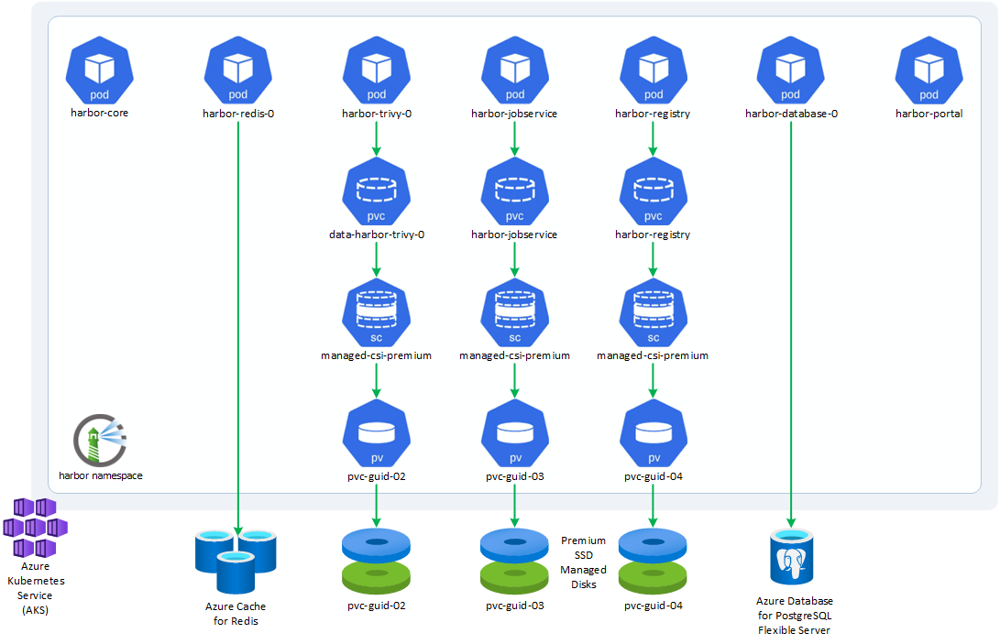

In this setup, the `Trivy`, `Job Service`, and `Registry` services utilize an [Azure Managed Disk](https://learn.microsoft.com/en-us/azure/virtual-machines/disks-types) as a persistent volume for data storage. These managed disks are created by the AKS cluster identity within the node resource group, which contains the resources associated with the cluster. The `Database` service is configured to use the [Azure Database for PostgreSQL flexible server](https://learn.microsoft.com/en-us/azure/postgresql/flexible-server/overview) provisoned by the script. Likewise, the `Redis` service is configured to utilize the newly created [Azure Cache for Redis](https://learn.microsoft.com/en-us/azure/azure-cache-for-redis/cache-overview).

```bash
#!/bin/bash

# Variables
source ./00-variables.sh

# Check if the resource group already exists
echo "Checking if [$harborResourceGroupName] resource group actually exists in the [$subscriptionName] subscription..."

az group show --name $harborResourceGroupName &>/dev/null

if [[ $? != 0 ]]; then
  echo "No [$harborResourceGroupName] resource group actually exists in the [$subscriptionName] subscription"
  echo "Creating [$harborResourceGroupName] resource group in the [$subscriptionName] subscription..."

  # Create the resource group
  az group create --name $harborResourceGroupName --location $location 1>/dev/null

  if [[ $? == 0 ]]; then
    echo "[$harborResourceGroupName] resource group successfully created in the [$subscriptionName] subscription"
  else
    echo "Failed to create [$harborResourceGroupName] resource group in the [$subscriptionName] subscription"
    exit
  fi
else
  echo "[$harborResourceGroupName] resource group already exists in the [$subscriptionName] subscription"
fi

# Check if the server virtual network already exists
echo "Checking if [$virtualNetworkName] virtual network actually exists in the [$harborResourceGroupName] resource group..."
az network vnet show \
  --name $virtualNetworkName \
  --only-show-errors \
  --resource-group $harborResourceGroupName &>/dev/null

if [[ $? != 0 ]]; then
  echo "No [$virtualNetworkName] virtual network actually exists in the [$harborResourceGroupName] resource group"
  echo "Creating [$virtualNetworkName] virtual network in the [$harborResourceGroupName] resource group..."

  # Create the server virtual network
  az network vnet create \
    --name $virtualNetworkName \
    --resource-group $harborResourceGroupName \
    --location $location \
    --address-prefixes $virtualNetworkAddressPrefix \
    --subnet-name $defaultSubnetName \
    --subnet-prefix $defaultSubnetPrefix \
    --only-show-errors 1>/dev/null

  if [[ $? == 0 ]]; then
    echo "[$virtualNetworkName] virtual network successfully created in the [$harborResourceGroupName] resource group"
  else
    echo "Failed to create [$virtualNetworkName] virtual network in the [$harborResourceGroupName] resource group"
    exit
  fi
else
  echo "[$virtualNetworkName] virtual network already exists in the [$harborResourceGroupName] resource group"
fi

# Check if the subnet for Azure Database for PostgreSQL flexible server already exists
echo "Checking if [$postgreSqlSubnetName] backend subnet actually exists in the [$virtualNetworkName] virtual network..."
az network vnet subnet show \
  --name $postgreSqlSubnetName \
  --vnet-name $virtualNetworkName \
  --resource-group $harborResourceGroupName \
  --only-show-errors &>/dev/null

if [[ $? != 0 ]]; then
  echo "No [$postgreSqlSubnetName] backend subnet actually exists in the [$virtualNetworkName] virtual network"
  echo "Creating [$postgreSqlSubnetName] backend subnet in the [$virtualNetworkName] virtual network..."

  # Create the backend subnet
  az network vnet subnet create \
    --name $postgreSqlSubnetName \
    --vnet-name $virtualNetworkName \
    --resource-group $harborResourceGroupName \
    --address-prefix $postgreSqlSubnetPrefix \
    --delegations "Microsoft.DBforPostgreSQL/flexibleServers" \
    --only-show-errors 1>/dev/null

  if [[ $? == 0 ]]; then
    echo "[$postgreSqlSubnetName] backend subnet successfully created in the [$virtualNetworkName] virtual network"
  else
    echo "Failed to create [$postgreSqlSubnetName] backend subnet in the [$virtualNetworkName] virtual network"
    exit
  fi
else
  echo "[$postgreSqlSubnetName] backend subnet already exists in the [$virtualNetworkName] virtual network"
fi

# Retrieve the resource id of the subnet
echo "Retrieving [$postgreSqlSubnetName] backend subnet resource id in the [$virtualNetworkName] virtual network..."
postgreSqlSubnetResourceId=$(az network vnet subnet show \
  --name $postgreSqlSubnetName \
  --vnet-name $virtualNetworkName \
  --resource-group $harborResourceGroupName \
  --query id \
  --output tsv \
  --only-show-errors)

if [[ -z $postgreSqlSubnetResourceId ]]; then
  echo "Failed to retrieve [$postgreSqlSubnetName] backend subnet resource id in the [$virtualNetworkName] virtual network"
  exit
fi

# Check if the private DNS Zone already exists
az network private-dns zone show \
  --name $postgreSqlPrivateDnsZoneName \
  --resource-group $harborResourceGroupName \
  --only-show-errors &>/dev/null

if [[ $? != 0 ]]; then
  echo "No [$postgreSqlPrivateDnsZoneName] private DNS zone actually exists in the [$harborResourceGroupName] resource group"
  echo "Creating [$postgreSqlPrivateDnsZoneName] private DNS zone in the [$harborResourceGroupName] resource group..."

  # Create the private DNS Zone
  az network private-dns zone create \
    --name $postgreSqlPrivateDnsZoneName \
    --resource-group $harborResourceGroupName \
    --only-show-errors 1>/dev/null

  if [[ $? == 0 ]]; then
    echo "[$postgreSqlPrivateDnsZoneName] private DNS zone successfully created in the [$harborResourceGroupName] resource group"
  else
    echo "Failed to create [$postgreSqlPrivateDnsZoneName] private DNS zone in the [$harborResourceGroupName] resource group"
    exit
  fi
else
  echo "[$postgreSqlPrivateDnsZoneName] private DNS zone already exists in the [$harborResourceGroupName] resource group"
fi

# Check if the private DNS Zone virtual network link already exists
az network private-dns link vnet show \
  --name $postgreSqlPrivateDnsZoneVirtualNetworkLinkName \
  --resource-group $harborResourceGroupName \
  --zone-name $postgreSqlPrivateDnsZoneName \
  --only-show-errors &>/dev/null

if [[ $? != 0 ]]; then
  echo "No [$postgreSqlPrivateDnsZoneVirtualNetworkLinkName] private DNS zone virtual network link actually exists in the [$harborResourceGroupName] resource group"

  # Retrieve the client virtual network resource id
  virtualNetworkResourceId=$(az network vnet show \
    --name $virtualNetworkName \
    --resource-group $harborResourceGroupName \
    --only-show-errors \
    --query id \
    --output tsv)

  if [[ -z $virtualNetworkResourceId ]]; then
    echo "Failed to retrieve [$virtualNetworkName] client virtual network resource id in the [$harborResourceGroupName] resource group"
    exit
  fi

  echo "Creating [$postgreSqlPrivateDnsZoneVirtualNetworkLinkName] private DNS zone virtual network link in the [$harborResourceGroupName] resource group..."

  # Create the private DNS Zone virtual network link
  az network private-dns link vnet create \
    --name $postgreSqlPrivateDnsZoneVirtualNetworkLinkName \
    --resource-group $harborResourceGroupName \
    --zone-name $postgreSqlPrivateDnsZoneName \
    --virtual-network $virtualNetworkResourceId \
    --registration-enabled false \
    --only-show-errors 1>/dev/null

  if [[ $? == 0 ]]; then
    echo "[$postgreSqlPrivateDnsZoneVirtualNetworkLinkName] private DNS zone virtual network link successfully created in the [$harborResourceGroupName] resource group"
  else
    echo "Failed to create [$postgreSqlPrivateDnsZoneVirtualNetworkLinkName] private DNS zone virtual network link in the [$harborResourceGroupName] resource group"
    exit
  fi
else
  echo "[$postgreSqlPrivateDnsZoneVirtualNetworkLinkName] private DNS zone virtual network link already exists in the [$harborResourceGroupName] resource group"
fi

# Retrieve the resource id of the private DNS Zone
echo "Retrieving [$postgreSqlPrivateDnsZoneName] private DNS zone resource id in the [$harborResourceGroupName] resource group..."
postgreSqlPrivateDnsZoneResourceId=$(az network private-dns zone show \
  --name $postgreSqlPrivateDnsZoneName \
  --resource-group $harborResourceGroupName \
  --query id \
  --output tsv \
  --only-show-errors)

# Check if Azure Database for PostgreSQL flexible server exists
echo "Checking if [$postgreSqlServerName] Azure Database for PostgreSQL flexible server actually exists in the [$harborResourceGroupName] resource group..."
az postgres flexible-server show \
  --name ${postgreSqlServerName,,} \
  --resource-group $harborResourceGroupName \
  --only-show-errors &>/dev/null

if [[ $? != 0 ]]; then
  echo "No [$postgreSqlServerName] Azure Database for PostgreSQL flexible server exists in the [$harborResourceGroupName] resource group"
  echo "Creating [$postgreSqlServerName] Azure Database for PostgreSQL flexible server in the [$harborResourceGroupName] resource group..."

  # Create Azure Database for PostgreSQL flexible server
  az postgres flexible-server create \
    --name $postgreSqlServerName \
    --resource-group $harborResourceGroupName \
    --location $location \
    --active-directory-auth $postgreSqlActiveDirectoryAuth \
    --sku-name $postgreSqlSkuName \
    --storage-size $postgreSqlStorageSize \
    --version $postgreSqlVersion \
    --admin-user $postgreSqlAdminUsername \
    --admin-password $postgreSqlAdminPassword \
    --database-name $postgreSqlDatabaseName \
    --subnet $postgreSqlSubnetResourceId \
    --private-dns-zone $postgreSqlPrivateDnsZoneResourceId \
    --tags "Environment=Test" "Project=Harbor" "Department=IT" \
    --only-show-errors 1>/dev/null

  if [[ $? == 0 ]]; then
    echo "[$postgreSqlServerName] Azure Database for PostgreSQL flexible server successfully created in the [$harborResourceGroupName] resource group"
  else
    echo "Failed to create [$postgreSqlServerName] Azure Database for PostgreSQL flexible server in the [$harborResourceGroupName] resource group"
    exit
  fi
fi

# Retrieve the fullyQualifiedDomainName of the Azure Database for PostgreSQL flexible server
echo "Retrieving the fullyQualifiedDomainName of the [$postgreSqlServerName] Azure Database for PostgreSQL flexible server in the [$harborResourceGroupName] resource group..."
postgreSqlFullyQualifiedDomainName=$(az postgres flexible-server show \
  --name ${postgreSqlServerName,,} \
  --resource-group $harborResourceGroupName \
  --query fullyQualifiedDomainName \
  --output tsv \
  --only-show-errors)

if [[ -n $postgreSqlFullyQualifiedDomainName ]]; then
  echo "[$postgreSqlFullyQualifiedDomainName] fullyQualifiedDomainName for the [$postgreSqlServerName] Azure Database for PostgreSQL flexible server successfully retrieved"
else
  echo "Failed to retrieve the fullyQualifiedDomainName of the [$postgreSqlServerName] Azure Database for PostgreSQL flexible server in the [$harborResourceGroupName] resource group"
  exit
fi

# Check if the Azure Cache for Redis already exists
echo "Checking if [$redisCacheName] Azure Cache for Redis actually exists in the [$harborResourceGroupName] resource group..."
az redis show \
  --name $redisCacheName \
  --resource-group $harborResourceGroupName \
  --only-show-errors &>/dev/null

if [[ $? != 0 ]]; then
  echo "No [$redisCacheName] Azure Cache for Redis actually exists in the [$harborResourceGroupName] resource group"
  echo "Creating [$redisCacheName] Azure Cache for Redis in the [$harborResourceGroupName] resource group..."

  # Create the Azure Cache for Redis
  az redis create \
    --name $redisCacheName \
    --resource-group $harborResourceGroupName \
    --enable-non-ssl-port \
    --location $location \
    --sku $redisCacheSku \
    --mi-system-assigned \
    --vm-size $redisCacheVmSize \
    --tags "Environment=Test" "Project=Harbor" "Department=IT" \
    --only-show-errors 1>/dev/null

  if [[ $? == 0 ]]; then
    echo "[$redisCacheName] Azure Cache for Redis successfully created in the [$harborResourceGroupName] resource group"
  else
    echo "Failed to create [$redisCacheName] Azure Cache for Redis in the [$harborResourceGroupName] resource group"
    exit
  fi
else
  echo "[$redisCacheName] Azure Cache for Redis already exists in the [$harborResourceGroupName] resource group"
fi

# Retrieve the resource id of the Azure Cache for Redis
echo "Retrieving the resource id of the [$redisCacheName] Azure Cache for Redis in the [$harborResourceGroupName] resource group..."
redisCacheResourceId=$(az redis show \
  --name $redisCacheName \
  --resource-group $harborResourceGroupName \
  --query id \
  --output tsv \
  --only-show-errors)

if [[ -n $redisCacheResourceId ]]; then
  echo "[$redisCacheResourceId] resource id for the [$redisCacheName] Azure Cache for Redis successfully retrieved"
else
  echo "Failed to retrieve the resource id of the [$redisCacheName] Azure Cache for Redis in the [$harborResourceGroupName] resource group"
  exit
fi

# Retrieve the hostname of the Azure Cache for Redis
echo "Retrieving the hostname of the [$redisCacheName] Azure Cache for Redis in the [$harborResourceGroupName] resource group..."
redisCacheHostName=$(az redis show \
  --name $redisCacheName \
  --resource-group $harborResourceGroupName \
  --query hostName \
  --output tsv \
  --only-show-errors)

if [[ -n $redisCacheHostName ]]; then
  echo "[$redisCacheHostName] hostname for the [$redisCacheName] Azure Cache for Redis successfully retrieved"
else
  echo "Failed to retrieve the hostname of the [$redisCacheName] Azure Cache for Redis in the [$harborResourceGroupName] resource group"
  exit
fi

# Retrieve the port of the Azure Cache for Redis
echo "Retrieving the port of the [$redisCacheName] Azure Cache for Redis in the [$harborResourceGroupName] resource group..."
redisCachePort=$(az redis show \
  --name $redisCacheName \
  --resource-group $harborResourceGroupName \
  --query port \
  --output tsv \
  --only-show-errors)

if [[ -n $redisCachePort ]]; then
  echo "[$redisCachePort] port for the [$redisCacheName] Azure Cache for Redis successfully retrieved"
else
  echo "Failed to retrieve the port of the [$redisCacheName] Azure Cache for Redis in the [$harborResourceGroupName] resource group"
  exit
fi

# Retrieve the primary key of the Azure Cache for Redis
echo "Retrieving the primary key of the [$redisCacheName] Azure Cache for Redis in the [$harborResourceGroupName] resource group..."
redisCachePrimaryKey=$(az redis list-keys \
  --name $redisCacheName \
  --resource-group $harborResourceGroupName \
  --query primaryKey \
  --output tsv \
  --only-show-errors)

if [[ -n $redisCachePrimaryKey ]]; then
  echo "[$redisCachePrimaryKey] primary key for the [$redisCacheName] Azure Cache for Redis successfully retrieved"
else
  echo "Failed to retrieve the primary key of the [$redisCacheName] Azure Cache for Redis in the [$harborResourceGroupName] resource group"
  exit
fi

# Check if the private DNS Zone already exists
az network private-dns zone show \
  --name $redisPrivateDnsZoneName \
  --resource-group $harborResourceGroupName \
  --only-show-errors &>/dev/null

if [[ $? != 0 ]]; then
  echo "No [$redisPrivateDnsZoneName] private DNS zone actually exists in the [$harborResourceGroupName] resource group"
  echo "Creating [$redisPrivateDnsZoneName] private DNS zone in the [$harborResourceGroupName] resource group..."

  # Create the private DNS Zone
  az network private-dns zone create \
    --name $redisPrivateDnsZoneName \
    --resource-group $harborResourceGroupName \
    --only-show-errors 1>/dev/null

  if [[ $? == 0 ]]; then
    echo "[$redisPrivateDnsZoneName] private DNS zone successfully created in the [$harborResourceGroupName] resource group"
  else
    echo "Failed to create [$redisPrivateDnsZoneName] private DNS zone in the [$harborResourceGroupName] resource group"
    exit
  fi
else
  echo "[$redisPrivateDnsZoneName] private DNS zone already exists in the [$harborResourceGroupName] resource group"
fi

# Check if the private DNS Zone virtual network link already exists
az network private-dns link vnet show \
  --name $redisPrivateDnsZoneVirtualNetworkLinkName \
  --resource-group $harborResourceGroupName \
  --zone-name $redisPrivateDnsZoneName \
  --only-show-errors &>/dev/null

if [[ $? != 0 ]]; then
  echo "No [$redisPrivateDnsZoneVirtualNetworkLinkName] private DNS zone virtual network link actually exists in the [$harborResourceGroupName] resource group"

  # Retrieve the client virtual network resource id
  virtualNetworkResourceId=$(az network vnet show \
    --name $virtualNetworkName \
    --resource-group $harborResourceGroupName \
    --only-show-errors \
    --query id \
    --output tsv)

  if [[ -z $virtualNetworkResourceId ]]; then
    echo "Failed to retrieve [$virtualNetworkName] client virtual network resource id in the [$harborResourceGroupName] resource group"
    exit
  fi

  echo "Creating [$redisPrivateDnsZoneVirtualNetworkLinkName] private DNS zone virtual network link in the [$harborResourceGroupName] resource group..."

  # Create the private DNS Zone virtual network link
  az network private-dns link vnet create \
    --name $redisPrivateDnsZoneVirtualNetworkLinkName \
    --resource-group $harborResourceGroupName \
    --zone-name $redisPrivateDnsZoneName \
    --virtual-network $virtualNetworkResourceId \
    --registration-enabled false \
    --only-show-errors 1>/dev/null

  if [[ $? == 0 ]]; then
    echo "[$redisPrivateDnsZoneVirtualNetworkLinkName] private DNS zone virtual network link successfully created in the [$harborResourceGroupName] resource group"
  else
    echo "Failed to create [$redisPrivateDnsZoneVirtualNetworkLinkName] private DNS zone virtual network link in the [$harborResourceGroupName] resource group"
    exit
  fi
else
  echo "[$redisPrivateDnsZoneVirtualNetworkLinkName] private DNS zone virtual network link already exists in the [$harborResourceGroupName] resource group"
fi

# Retrieve the resource id of the private DNS Zone
echo "Retrieving [$redisPrivateDnsZoneName] private DNS zone resource id in the [$harborResourceGroupName] resource group..."
redisPrivateDnsZoneResourceId=$(az network private-dns zone show \
  --name $redisPrivateDnsZoneName \
  --resource-group $harborResourceGroupName \
  --query id \
  --output tsv \
  --only-show-errors)

# Check if the private endpoint for the Azure Cache for Redis resource already exists
privateEndpointId=$(az network private-endpoint list \
  --resource-group $harborResourceGroupName \
  --only-show-errors \
  --query "[?name=='$redisCachePrivateEndpointName'].id" \
  --output tsv)

if [[ -z $privateEndpointId ]]; then
  echo "Private endpoint [$redisCachePrivateEndpointName] does not exist"
  echo "Creating a private endpoint for the [$redisCacheName] Azure Cache for Redis..."

  # Create a private endpoint for th Azure Cache for Redis resource
  az network private-endpoint create \
    --name $redisCachePrivateEndpointName \
    --resource-group $harborResourceGroupName \
    --vnet-name $virtualNetworkName \
    --subnet $defaultSubnetName \
    --group-id redisCache \
    --private-connection-resource-id $redisCacheResourceId \
    --connection-name "${redisCacheName}Connection" \
    --only-show-errors 1>/dev/null

  if [[ $? == 0 ]]; then
    echo "Private endpoint successfully created for the [$redisCacheName] Azure Cache for Redis"
  else
    echo "Failed to create a private endpoint for the [$redisCacheName] Azure Cache for Redis"
    exit
  fi
else
  echo "Private endpoint [$redisCachePrivateEndpointName] already exists"
fi

# Check if the Private DNS Zone Group already exists
echo "Checking if [$redisCachePrivateDnsZoneGroupName] Private DNS Zone Group actually exists in the [$redisCachePrivateEndpointName] private endpoint..."
groupResourceId=$(az network private-endpoint dns-zone-group show \
  --name $redisCachePrivateDnsZoneGroupName \
  --endpoint-name $redisCachePrivateEndpointName \
  --resource-group $harborResourceGroupName \
  --only-show-errors \
  --query id \
  --output tsv)

if [[ -z $groupResourceId ]]; then
  echo "No [$redisCachePrivateDnsZoneGroupName] Private DNS Zone Group actually exists in the [$redisCachePrivateEndpointName] private endpoint"
  echo "Creating [$redisCachePrivateDnsZoneGroupName] Private DNS Zone Group in the [$redisCachePrivateEndpointName] private endpoint..."

  # Create the Private DNS Zone Group
  az network private-endpoint dns-zone-group create \
    --name $redisCachePrivateDnsZoneGroupName \
    --endpoint-name $redisCachePrivateEndpointName \
    --resource-group $harborResourceGroupName \
    --private-dns-zone $redisPrivateDnsZoneResourceId \
    --zone-name $redisPrivateDnsZoneName \
    --only-show-errors 1>/dev/null

  if [[ $? == 0 ]]; then
    echo "[$redisCachePrivateDnsZoneGroupName] Private DNS Zone Group successfully created in the [$redisCachePrivateEndpointName] private endpoint"
  else
    echo "Failed to create [$redisCachePrivateDnsZoneGroupName] Private DNS Zone Group in the [$redisCachePrivateEndpointName] private endpoint"
    exit
  fi
else
  echo "[$redisCachePrivateDnsZoneGroupName] Private DNS Zone Group already exists in the [$redisCachePrivateEndpointName] private endpoint"
fi

# Check if the Harbor repository is not already added
result=$(helm repo list | grep $harborRepoName | awk '{print $1}')

if [[ -n $result ]]; then
  echo "[$harborRepoName] Helm repo already exists"
else
  # Add the ingress-Harbor repository
  echo "Adding [$harborRepoName] Helm repo..."
  helm repo add $harborRepoName $harborRepoUrl
fi

# Update your local Helm chart repository cache
echo 'Updating Helm repos...'
helm repo update

# Use Helm to deploy Harbor
result=$(helm list -n $harborNamespace | grep $harborReleaseName | awk '{print $1}')

if [[ -n $result ]]; then
  echo "[$harborReleaseName] release already exists in the [$harborNamespace] namespace"

  # Upgrade Harbor
  echo "Upgrading [$harborReleaseName] release in the [$harborNamespace] namespace..."
  helm upgrade $harborReleaseName $harborRepoName/$harborChartName \
    --install \
    --create-namespace \
    --namespace $harborNamespace \
    --set externalURL=https://$harborHostname \
    --set harborAdminPassword=$harborAdminPassword \
    --set expose.type=$harborExposeType \
    --set expose.tls.certSource=secret \
    --set expose.tls.secret.secretName=$harborTlsSecretName \
    --set expose.ingress.hosts.core=$harborHostname \
    --set expose.ingress.className=$nginxIngressClassName \
    --set expose.ingress.annotations."cert-manager\.io/cluster-issuer"=$certManagerClusterIssuer \
    --set expose.ingress.annotations."cert-manager\.io/acme-challenge-type"=$certManagerAcmeChallengeType \
    --set database.type=external \
    --set database.external.host=$postgreSqlFullyQualifiedDomainName \
    --set database.external.port=5432 \
    --set database.external.username=$postgreSqlAdminUsername \
    --set database.external.password=$postgreSqlAdminPassword \
    --set database.external.database=$postgreSqlDatabaseName \
    --set database.external.sslmode=require \
    --set redis.type=external \
    --set redis.external.addr=$redisCacheHostName:$redisCachePort \
    --set redis.external.password=$redisCachePrimaryKey \
    --set persistence.enabled=true \
    --set persistence.persistentVolumeClaim.registry.storageClass=$harborRegistryStorageClass \
    --set persistence.persistentVolumeClaim.jobservice.jobLog.storageClass=$harborRegistryStorageClass \
    --set persistence.persistentVolumeClaim.trivy.storageClass=$harborRegistryStorageClass \
    --set persistence.persistentVolumeClaim.registry.size=$registrySize \
    --set persistence.persistentVolumeClaim.jobservice.jobLog.size=$jobserviceJobLogSize \
    --set persistence.persistentVolumeClaim.trivy.size=$trivySize \
    --set portal.replicas=$portalReplicaCount \
    --set core.replicas=$coreReaplicaCount \
    --set jobservice.replicas=$jobserviceReplicaCount \
    --set registry.replicas=$registryReplicaCount \
    --set trivy.replicas=$trivyReplicaCount
else
  # Install Harbor
  echo "Installing [$harborReleaseName] release in the [$harborNamespace] namespace..."
  helm install $harborReleaseName $harborRepoName/$harborChartName \
    --create-namespace \
    --namespace $harborNamespace \
    --set externalURL=https://$harborHostname \
    --set harborAdminPassword=$harborAdminPassword \
    --set expose.type=$harborExposeType \
    --set expose.tls.certSource=secret \
    --set expose.tls.secret.secretName=$harborTlsSecretName \
    --set expose.ingress.hosts.core=$harborHostname \
    --set expose.ingress.className=$nginxIngressClassName \
    --set expose.ingress.annotations."cert-manager\.io/cluster-issuer"=$certManagerClusterIssuer \
    --set expose.ingress.annotations."cert-manager\.io/acme-challenge-type"=$certManagerAcmeChallengeType \
    --set database.type=external \
    --set database.external.host=$postgreSqlFullyQualifiedDomainName \
    --set database.external.port=5432 \
    --set database.external.username=$postgreSqlAdminUsername \
    --set database.external.password=$postgreSqlAdminPassword \
    --set database.external.database=$postgreSqlDatabaseName \
    --set database.external.sslmode=require \
    --set redis.type=external \
    --set redis.external.addr=$redisCacheHostName:$redisCachePort \
    --set redis.external.password=$redisCachePrimaryKey \
    --set persistence.enabled=true \
    --set persistence.persistentVolumeClaim.registry.storageClass=$harborRegistryStorageClass \
    --set persistence.persistentVolumeClaim.jobservice.jobLog.storageClass=$harborRegistryStorageClass \
    --set persistence.persistentVolumeClaim.trivy.storageClass=$harborRegistryStorageClass \
    --set persistence.persistentVolumeClaim.registry.size=$registrySize \
    --set persistence.persistentVolumeClaim.jobservice.jobLog.size=$jobserviceJobLogSize \
    --set persistence.persistentVolumeClaim.trivy.size=$trivySize \
    --set portal.replicas=$portalReplicaCount \
    --set core.replicas=$coreReaplicaCount \
    --set jobservice.replicas=$jobserviceReplicaCount \
    --set registry.replicas=$registryReplicaCount \
    --set trivy.replicas=$trivyReplicaCount
fi

# Get values
helm get values $harborReleaseName --namespace $harborNamespace
```

The picture below depicts an AKS cluster setup where Harbor is integrated with [Azure Database for PostgreSQL flexible server](https://learn.microsoft.com/en-us/azure/postgresql/flexible-server/overview) and [Azure Cache for Redis](https://learn.microsoft.com/en-us/azure/azure-cache-for-redis/cache-overview). To ensure private and secure connectivity, the `Redis` service establishes a connection to the managed cache through an [Azure Private Endpoint](https://learn.microsoft.com/en-us/azure/private-link/private-endpoint-overview).

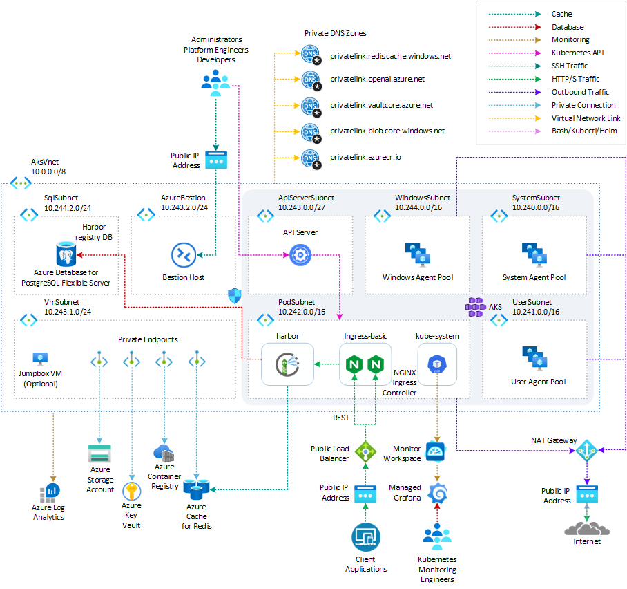

This configuration guarantees that the `Redis` service can securely connect to the managed cache privately, enhancing the overall security and reliability of the Harbor deployment. Likewise, the `Database` service accesses the [Azure Database for PostgreSQL flexible server](https://learn.microsoft.com/en-us/azure/postgresql/flexible-server/overview) via a private IP address.

### Deploy Harbor across Availability Zones

If you want to deploy Harbor across the [Azure availability zones](https://learn.microsoft.com/en-us/azure/reliability/availability-zones-overview) within a region, you need to create multiple replicas of each service and make sure to run at least one replica in each availability zone. Availability zones are a high-availability offering that protects your applications and data from datacenter failures. Zones are unique physical locations within an Azure region. Each zone includes one or more datacenters equipped with independent power, cooling, and networking. To ensure resiliency, there's always more than one zone in all zone enabled regions. The physical separation of availability zones within a region protects applications and data from datacenter failures. For more information, see [What are availability zones in Azure?](https://learn.microsoft.com/en-us/azure/reliability/availability-zones-overview) in the Azure documentation.

#### Create an AKS cluster across availability zones

When creating a cluster using the [az aks create](https://learn.microsoft.com/en-us/cli/azure/aks#az-aks-create) command, the `--zones` parameter allows you to specify the availability zones for deploying agent nodes. However, it's important to note that this parameter does not control the deployment of managed control plane components. These components are automatically distributed across all available zones in the region during cluster deployment.

Here's an example that demonstrates creating an AKS cluster named `myAKSCluster` in the resource group named `myResourceGroup`, with a total of three nodes. One node is deployed in zone `1`, another in zone `2`, and the third in zone `3`. For more information, see [Create an AKS cluster across availability zones](https://learn.microsoft.com/en-us/azure/aks/availability-zones#create-an-aks-cluster-across-availability-zones).

```bash
az group create --name myResourceGroup --location eastus2

az aks create \
  --resource-group myResourceGroup \
  --name myAKSCluster \
  --generate-ssh-keys \
  --vm-set-type VirtualMachineScaleSets \
  --load-balancer-sku standard \
  --node-count 3 \
  --zones 1 2 3
```

When using a single node pool spanning across three availability zones, you need to use [Zone Redundant Storage for managed disks (ZRS)](https://learn.microsoft.com/en-us/azure/virtual-machines/disks-redundancy#zone-redundant-storage-for-managed-disks). In fact, if a pod replica attaches a persistent volume in one availability zone, and then the pod is rescheduled in another availability zone, the pod could not reattached the managed disk if this is configured to use [Locally Redundant Storage for managed disks](https://learn.microsoft.com/en-us/azure/virtual-machines/disks-redundancy#locally-redundant-storage-for-managed-disks).

When using a single node pool spanning across three availability zones, it is important to utilize [Zone Redundant Storage for managed disks (ZRS)](https://learn.microsoft.com/en-us/azure/virtual-machines/disks-redundancy#zone-redundant-storage-for-managed-disks) for persistent volumes. This ensures data availability and reliability. In scenarios where a pod replica attaches a persistent volume in one availability zone and gets rescheduled to another availability zone, the pod could not reattach the managed disk if it is configured with [Locally redundant storage for managed disks](https://learn.microsoft.com/en-us/azure/virtual-machines/disks-redundancy#locally-redundant-storage-for-managed-disks). To prevent potential issues, it is recommended to configure persistent volume claims to use a storage class that is set up to utilize [Zone Redundant Storage for managed disks (ZRS)](https://learn.microsoft.com/en-us/azure/virtual-machines/disks-redundancy#zone-redundant-storage-for-managed-disks). By doing so, you can ensure the persistence and availability of your data across availability zones. For more information on persistent volume claims, you can refer to the [official Kubernetes documentation](https://kubernetes.io/docs/concepts/storage/persistent-volumes).

To effectively use the cluster autoscaler with node pools spanning multiple zones and take advantage of zone-related scheduling features like volume topological scheduling, we recommend creating a separate node pool for each availability zone. Additionally, enabling the `--balance-similar-node-groups` option through the autoscaler profile ensures that the autoscaler can scale up and maintain balanced sizes across the node pools. This approach allows for optimal scaling and resource distribution within your AKS cluster. When using the AKS cluster autoscaler with node pools spanning multiple Availability Zones, there are a few considerations to keep in mind:

1. For node pools that use Azure Storage for persistent volumes, it is advisable to create a separate node pool for each zone. This is because persistent volumes cannot be used across zones, unless you use [Zone Redundant Storage for managed disks (ZRS)](https://learn.microsoft.com/en-us/azure/virtual-machines/disks-redundancy#zone-redundant-storage-for-managed-disks). By doing so, each new Virtual Machine in the node pool will be able to attach its respective persistent volumes.
2. If multiple node pools are created within each zone, it is recommended to enable the `--balance-similar-node-groups` property in the autoscaler profile. This feature helps identify similar node pools and ensures a balanced distribution of nodes across them.
3. However, if you are not utilizing Persistent Volumes, Cluster Autoscaler should work without any issues with node pools that span multiple Availability Zones.

#### Spread Pods across Zones using Pod Topology Spread Constraints

When deploying pods to an AKS cluster that spans multiple availability zones, it is essential to ensure optimal distribution and resilience. To achieve this, you can utilize the [Pod Topology Spread Constraints](https://kubernetes.io/docs/concepts/workloads/pods/pod-topology-spread-constraints/) Kubernetes feature. By implementing Pod Topology Spread Constraints, you gain granular control over how pods are spread across your AKS cluster, taking into account failure-domains like regions, availability zones, and nodes. Specifically, you can create constraints that span pod replicas across availability zones, as well as across different nodes within a single availability zone. By doing so, you can achieve several benefits. First, spreading pod replicas across availability zones ensures that your application remains available even if an entire zone goes down. Second, distributing pods across different nodes within a zone enhances fault tolerance, as it minimizes the impact of node failures or maintenance activities. By using Pod Topology Spread Constraints, you can maximize the resilience and availability of your applications in an AKS cluster. This approach optimizes resource utilization, minimizes downtime, and delivers a robust infrastructure for your workloads across multiple availability zones and nodes.

#### Custom ZRS Storage Classes

The official [Harbor Helm Chart](https://github.com/goharbor/harbor-helm) provides flexibility in defining storage classes for provisioning persistent volumes used by each service. There are built-in storage classes available for managed disks and Azure Files:

- For managed disks:
  - `managed-csi`: Uses Azure Standard SSD locally redundant storage (LRS) to create a managed disk.
  - `managed-csi-premium`: Uses Azure Premium LRS to create a managed disk.
- For Azure Files:
  - `azurefile-csi`: Uses Azure Standard Storage to create an Azure file share.
  - `azurefile-csi-premium`: Uses Azure Premium Storage to create an Azure file share.

While these built-in storage classes are suitable for most scenarios, they use `Standard_LRS` and `Premium_LRS`, which employ Locally Redundant Storage (LTS). However, to create pods across availability zones in a zone-redundant AKS cluster, you need to use [Zone Redundant Storage for managed disks (ZRS)](https://learn.microsoft.com/en-us/azure/virtual-machines/disks-redundancy#zone-redundant-storage-for-managed-disks) for persistent volumes.

Zone Redundant Storage (ZRS) synchronously replicates your Azure managed disk across three availability zones within your selected region. Each availability zone is a separate physical location with independent power, cooling, and networking. With ZRS disks, you benefit from at least 99.9999999999% (12 9's) of durability over a year and the ability to recover from failures in availability zones. In case a zone goes down, a ZRS disk can be attached to a virtual machine (VM) in a different zone.

To create a custom storage class using `StandardSSD_ZRS` or `Premium_ZRS` managed disks, you can use the following example:

```yaml
apiVersion: storage.k8s.io/v1
kind: StorageClass
metadata:
  name: managed-csi-premium-zrs
provisioner: disk.csi.azure.com
parameters:
  skuname: Premium_ZRS
reclaimPolicy: Delete
volumeBindingMode: WaitForFirstConsumer
allowVolumeExpansion: true
```

For more information on the parameters for the [Azure Disk CSI Driver](https://learn.microsoft.com/en-us/azure/aks/azure-disk-csi), refer to the [Azure Disk CSI Driver Parameters](https://github.com/kubernetes-sigs/azuredisk-csi-driver/blob/master/docs/driver-parameters.md) documentation.

Similarly, you can create a storage class using the [Azure Files CSI Driver](https://learn.microsoft.com/en-us/azure/aks/azure-files-csi) with `Standard_ZRS`, `Standard_RAGZRS`, and `Premium_ZRS` storage options, ensuring that data copies are stored across different zones within a region:

```yaml
apiVersion: storage.k8s.io/v1
kind: StorageClass
metadata:
  name: azurefile-csi-premium-zrs
mountOptions:
- mfsymlinks
- actimeo=30
parameters:
  skuName: Premium_ZRS
  enableLargeFileShares: "true"
provisioner: file.csi.azure.com
reclaimPolicy: Delete
volumeBindingMode: Immediate
```

For more information about the parameters for the [Azure Files CSI Driver](https://learn.microsoft.com/en-us/azure/aks/azure-disk-csi), refer to the [Azure File CSI Driver Parameters](https://github.com/kubernetes-sigs/azurefile-csi-driver/blob/master/docs/driver-parameters.md) documentation.

#### Harbor with ZRS Azure Files and Managed Disks

The official [Harbor Helm Chart](https://github.com/goharbor/harbor-helm) provides flexibility in definining [Pod Topology Spread Constraints](https://kubernetes.io/docs/concepts/workloads/pods/pod-topology-spread-constraints/) for each service. The `05-deploy-harbor-via-helm-across-azs.sh` script deploys Harbor to a zone-redundant cluster employing Zone Redundant Storage (ZRS) storage for managed disks and Azure Files. The diagram below represents the deployment architecture.

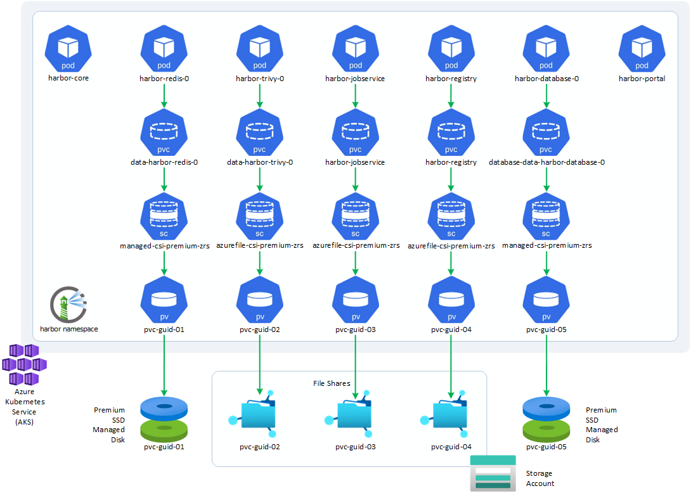

In this setup, the services `Trivy`, `Job Service`, and `Registry` utilize an [Azure File Share](https://learn.microsoft.com/en-us/azure/virtual-machines/disks-types) as the persistent volume for storing data. The AKS cluster identity creates a storage account with the specified kind and SKU mentioned in the storage class within the node resource group associated with the cluster. It then creates a file share for each persistent volume claim, with the size specified for each service. Note that the minimum size for a premium file share is 100 GiB. For detailed information, see [Azure Files scalability and performance targets](https://learn.microsoft.com/en-us/azure/storage/files/storage-files-scale-targets). On the other hand, the `Database` and `Redis` services utilize an Azure Managed Disk as the persistent volume for storing data.

```bash
#!/bin/bash

# Variables
source ./00-variables.sh

# Check if the managed-csi-premium-zrs storage class exists
result=$(kubectl get storageclass -o jsonpath="{.items[?(@.metadata.name=='$managedCsiPremiumZrsStorageClassName')].metadata.name}")

if [[ -n $result ]]; then
  echo "$managedCsiPremiumZrsStorageClassName storage class already exists in the cluster"
else
  echo "$managedCsiPremiumZrsStorageClassName storage class does not exist in the cluster"
  echo "creating $managedCsiPremiumZrsStorageClassName storage class in the cluster..."
  kubectl apply -f ./managed-csi-premium-zrs.yml
fi

# Check if the azurefile-csi-premium-zrs storage class exists
result=$(kubectl get storageclass -o jsonpath="{.items[?(@.metadata.name=='$azureFilePremiumZrsStorageClassName')].metadata.name}")

if [[ -n $result ]]; then
  echo "$azureFilePremiumZrsStorageClassName storage class already exists in the cluster"
else
  echo "$azureFilePremiumZrsStorageClassName storage class does not exist in the cluster"
  echo "creating $azureFilePremiumZrsStorageClassName storage class in the cluster..."
  kubectl apply -f ./azurefile-csi-premium-zrs.yml
fi

# Check if the Harbor repository is not already added
result=$(helm repo list | grep $harborRepoName | awk '{print $1}')

if [[ -n $result ]]; then
  echo "[$harborRepoName] Helm repo already exists"
else
  # Add the ingress-Harbor repository
  echo "Adding [$harborRepoName] Helm repo..."
  helm repo add $harborRepoName $harborRepoUrl
fi

# Update your local Helm chart repository cache
echo 'Updating Helm repos...'
helm repo update

# Use Helm to deploy Harbor
result=$(helm list -n $harborNamespace | grep $harborReleaseName | awk '{print $1}')

if [[ -n $result ]]; then
  echo "[$harborReleaseName] release already exists in the [$harborNamespace] namespace"

  # Upgrade Harbor
  echo "Upgrading [$harborReleaseName] release in the [$harborNamespace] namespace..."
  helm upgrade $harborReleaseName $harborRepoName/$harborChartName \
    --install \
    --create-namespace \
    --namespace $harborNamespace \
    --set externalURL=https://$harborHostname \
    --set harborAdminPassword=$harborAdminPassword \
    --set expose.type=$harborExposeType \
    --set expose.tls.certSource=secret \
    --set expose.tls.secret.secretName=$harborTlsSecretName \
    --set expose.ingress.hosts.core=$harborHostname \
    --set expose.ingress.className=$nginxIngressClassName \
    --set expose.ingress.annotations."cert-manager\.io/cluster-issuer"=$certManagerClusterIssuer \
    --set expose.ingress.annotations."cert-manager\.io/acme-challenge-type"=$certManagerAcmeChallengeType \
    --set persistence.enabled=true \
    --set persistence.persistentVolumeClaim.registry.storageClass=$azureFilePremiumZrsStorageClassName \
    --set persistence.persistentVolumeClaim.registry.accessMode=ReadWriteMany \
    --set persistence.persistentVolumeClaim.registry.size=$registrySize \
    --set persistence.persistentVolumeClaim.jobservice.jobLog.storageClass=$azureFilePremiumZrsStorageClassName \
    --set persistence.persistentVolumeClaim.jobservice.accessMode=ReadWriteMany \
    --set persistence.persistentVolumeClaim.jobservice.jobLog.size=$jobserviceJobLogSize \
    --set persistence.persistentVolumeClaim.database.storageClass=$managedCsiPremiumZrsStorageClassName \
    --set persistence.persistentVolumeClaim.database.size=$databaseSize \
    --set persistence.persistentVolumeClaim.redis.storageClass=$managedCsiPremiumZrsStorageClassName \
    --set persistence.persistentVolumeClaim.redis.size=$redisSize \
    --set persistence.persistentVolumeClaim.trivy.storageClass=$azureFilePremiumZrsStorageClassName \
    --set persistence.persistentVolumeClaim.trivy.accessMode=ReadWriteMany \
    --set persistence.persistentVolumeClaim.trivy.size=$trivySize \
    --set portal.replicas=$portalReplicaCount \
    --set core.replicas=$coreReaplicaCount \
    --set jobservice.replicas=$jobserviceReplicaCount \
    --set registry.replicas=$registryReplicaCount \
    --set trivy.replicas=$trivyReplicaCount \
    --set portal.topologySpreadConstraints[0].maxSkew=1 \
    --set portal.topologySpreadConstraints[0].whenUnsatisfiable=ScheduleAnyway \
    --set portal.topologySpreadConstraints[0].topologyKey=topology.kubernetes.io/zone \
    --set portal.topologySpreadConstraints[1].maxSkew=1 \
    --set portal.topologySpreadConstraints[1].whenUnsatisfiable=ScheduleAnyway \
    --set portal.topologySpreadConstraints[1].topologyKey=kubernetes.io/hostname \
    --set core.topologySpreadConstraints[0].maxSkew=1 \
    --set core.topologySpreadConstraints[0].whenUnsatisfiable=ScheduleAnyway \
    --set core.topologySpreadConstraints[0].topologyKey=topology.kubernetes.io/zone \
    --set core.topologySpreadConstraints[1].maxSkew=1 \
    --set core.topologySpreadConstraints[1].whenUnsatisfiable=ScheduleAnyway \
    --set core.topologySpreadConstraints[1].topologyKey=kubernetes.io/hostname \
    --set jobservice.topologySpreadConstraints[0].maxSkew=1 \
    --set jobservice.topologySpreadConstraints[0].whenUnsatisfiable=ScheduleAnyway \
    --set jobservice.topologySpreadConstraints[0].topologyKey=topology.kubernetes.io/zone \
    --set jobservice.topologySpreadConstraints[1].maxSkew=1 \
    --set jobservice.topologySpreadConstraints[1].whenUnsatisfiable=ScheduleAnyway \
    --set jobservice.topologySpreadConstraints[1].topologyKey=kubernetes.io/hostname \
    --set registry.topologySpreadConstraints[0].maxSkew=1 \
    --set registry.topologySpreadConstraints[0].whenUnsatisfiable=ScheduleAnyway \
    --set registry.topologySpreadConstraints[0].topologyKey=topology.kubernetes.io/zone \
    --set registry.topologySpreadConstraints[1].maxSkew=1 \
    --set registry.topologySpreadConstraints[1].whenUnsatisfiable=ScheduleAnyway \
    --set registry.topologySpreadConstraints[1].topologyKey=kubernetes.io/hostname \
    --set trivy.topologySpreadConstraints[0].maxSkew=1 \
    --set trivy.topologySpreadConstraints[0].whenUnsatisfiable=ScheduleAnyway \
    --set trivy.topologySpreadConstraints[0].topologyKey=topology.kubernetes.io/zone \
    --set trivy.topologySpreadConstraints[1].maxSkew=1 \
    --set trivy.topologySpreadConstraints[1].whenUnsatisfiable=ScheduleAnyway \
    --set trivy.topologySpreadConstraints[1].topologyKey=kubernetes.io/hostname \
    --set exporter.topologySpreadConstraints[0].maxSkew=1 \
    --set exporter.topologySpreadConstraints[0].whenUnsatisfiable=ScheduleAnyway \
    --set exporter.topologySpreadConstraints[0].topologyKey=topology.kubernetes.io/zone \
    --set exporter.topologySpreadConstraints[1].maxSkew=1 \
    --set exporter.topologySpreadConstraints[1].whenUnsatisfiable=ScheduleAnyway \
    --set exporter.topologySpreadConstraints[1].topologyKey=kubernetes.io/hostname \
    --set persistence.persistentVolumeClaim.registry.size=$registrySize \
    --set persistence.persistentVolumeClaim.jobservice.size=$jobserviceJobLogSize \
    --set persistence.persistentVolumeClaim.database.size=$databaseSize \
    --set persistence.persistentVolumeClaim.redis.size=$redisSize \
    --set persistence.persistentVolumeClaim.trivy.size=$trivySize
else
  # Install Harbor
  echo "Installing [$harborReleaseName] release in the [$harborNamespace] namespace..."
  helm install $harborReleaseName $harborRepoName/$harborChartName \
    --create-namespace \
    --namespace $harborNamespace \
    --set externalURL=https://$harborHostname \
    --set harborAdminPassword=$harborAdminPassword \
    --set expose.type=$harborExposeType \
    --set expose.tls.certSource=secret \
    --set expose.tls.secret.secretName=$harborTlsSecretName \
    --set expose.ingress.hosts.core=$harborHostname \
    --set expose.ingress.className=$nginxIngressClassName \
    --set expose.ingress.annotations."cert-manager\.io/cluster-issuer"=$certManagerClusterIssuer \
    --set expose.ingress.annotations."cert-manager\.io/acme-challenge-type"=$certManagerAcmeChallengeType \
    --set persistence.enabled=true \
    --set persistence.persistentVolumeClaim.registry.storageClass=$azureFilePremiumZrsStorageClassName \
    --set persistence.persistentVolumeClaim.registry.accessMode=ReadWriteMany \
    --set persistence.persistentVolumeClaim.registry.size=$registrySize \
    --set persistence.persistentVolumeClaim.jobservice.jobLog.storageClass=$azureFilePremiumZrsStorageClassName \
    --set persistence.persistentVolumeClaim.jobservice.accessMode=ReadWriteMany \
    --set persistence.persistentVolumeClaim.jobservice.jobLog.size=$jobserviceJobLogSize \
    --set persistence.persistentVolumeClaim.database.storageClass=$managedCsiPremiumZrsStorageClassName \
    --set persistence.persistentVolumeClaim.database.size=$databaseSize \
    --set persistence.persistentVolumeClaim.redis.storageClass=$managedCsiPremiumZrsStorageClassName \
    --set persistence.persistentVolumeClaim.redis.size=$redisSize \
    --set persistence.persistentVolumeClaim.trivy.storageClass=$azureFilePremiumZrsStorageClassName \
    --set persistence.persistentVolumeClaim.trivy.accessMode=ReadWriteMany \
    --set persistence.persistentVolumeClaim.trivy.size=$trivySize \
    --set portal.replicas=$portalReplicaCount \
    --set core.replicas=$coreReaplicaCount \
    --set jobservice.replicas=$jobserviceReplicaCount \
    --set registry.replicas=$registryReplicaCount \
    --set trivy.replicas=$trivyReplicaCount \
    --set portal.topologySpreadConstraints[0].maxSkew=1 \
    --set portal.topologySpreadConstraints[0].whenUnsatisfiable=ScheduleAnyway \
    --set portal.topologySpreadConstraints[0].topologyKey=topology.kubernetes.io/zone \
    --set portal.topologySpreadConstraints[1].maxSkew=1 \
    --set portal.topologySpreadConstraints[1].whenUnsatisfiable=ScheduleAnyway \
    --set portal.topologySpreadConstraints[1].topologyKey=kubernetes.io/hostname \
    --set core.topologySpreadConstraints[0].maxSkew=1 \
    --set core.topologySpreadConstraints[0].whenUnsatisfiable=ScheduleAnyway \
    --set core.topologySpreadConstraints[0].topologyKey=topology.kubernetes.io/zone \
    --set core.topologySpreadConstraints[1].maxSkew=1 \
    --set core.topologySpreadConstraints[1].whenUnsatisfiable=ScheduleAnyway \
    --set core.topologySpreadConstraints[1].topologyKey=kubernetes.io/hostname \
    --set jobservice.topologySpreadConstraints[0].maxSkew=1 \
    --set jobservice.topologySpreadConstraints[0].whenUnsatisfiable=ScheduleAnyway \
    --set jobservice.topologySpreadConstraints[0].topologyKey=topology.kubernetes.io/zone \
    --set jobservice.topologySpreadConstraints[1].maxSkew=1 \
    --set jobservice.topologySpreadConstraints[1].whenUnsatisfiable=ScheduleAnyway \
    --set jobservice.topologySpreadConstraints[1].topologyKey=kubernetes.io/hostname \
    --set registry.topologySpreadConstraints[0].maxSkew=1 \
    --set registry.topologySpreadConstraints[0].whenUnsatisfiable=ScheduleAnyway \
    --set registry.topologySpreadConstraints[0].topologyKey=topology.kubernetes.io/zone \
    --set registry.topologySpreadConstraints[1].maxSkew=1 \
    --set registry.topologySpreadConstraints[1].whenUnsatisfiable=ScheduleAnyway \
    --set registry.topologySpreadConstraints[1].topologyKey=kubernetes.io/hostname \
    --set trivy.topologySpreadConstraints[0].maxSkew=1 \
    --set trivy.topologySpreadConstraints[0].whenUnsatisfiable=ScheduleAnyway \
    --set trivy.topologySpreadConstraints[0].topologyKey=topology.kubernetes.io/zone \
    --set trivy.topologySpreadConstraints[1].maxSkew=1 \
    --set trivy.topologySpreadConstraints[1].whenUnsatisfiable=ScheduleAnyway \
    --set trivy.topologySpreadConstraints[1].topologyKey=kubernetes.io/hostname \
    --set exporter.topologySpreadConstraints[0].maxSkew=1 \
    --set exporter.topologySpreadConstraints[0].whenUnsatisfiable=ScheduleAnyway \
    --set exporter.topologySpreadConstraints[0].topologyKey=topology.kubernetes.io/zone \
    --set exporter.topologySpreadConstraints[1].maxSkew=1 \
    --set exporter.topologySpreadConstraints[1].whenUnsatisfiable=ScheduleAnyway \
    --set exporter.topologySpreadConstraints[1].topologyKey=kubernetes.io/hostname \
    --set persistence.persistentVolumeClaim.registry.size=$registrySize \
    --set persistence.persistentVolumeClaim.jobservice.size=$jobserviceJobLogSize \
    --set persistence.persistentVolumeClaim.database.size=$databaseSize \
    --set persistence.persistentVolumeClaim.redis.size=$redisSize \
    --set persistence.persistentVolumeClaim.trivy.size=$trivySize
fi

# Get values
helm get values $harborReleaseName --namespace $harborNamespace
```

## Network Topologies in Azure

In a multi-region scenario where multiple AKS clusters are deployed, it is crucial to consider the network topology to optimize performance, cost, and security. Relying on a single Harbor instance located in a single AKS cluster within a region can lead to latency issues, increased bandwidth usage, and higher network costs. Moreover, such a setup creates a single point of failure and does not provide the necessary business continuity.

To address these concerns, it is recommended to establish a distributed environment with a main Harbor instance serving as the central source of truth for publishing images and artifacts. Multiple peripheral Harbor instances can be deployed to create copies of these container images and artifacts via pull or push replication rules. This architecture enhances reliability and ensures that the artifacts are available across different regions.

To achieve this, the AKS clusters hosting the main Harbor instance and the Harbor replica instances can be connected using various networking approaches. These include:

- `Public IP Addresses`: Exposing the Harbor instances via the public internet. By configuring the Harbor instances with public IP addresses and exposing them directly to the internet, workloads from different AKS clusters can communicate with each other. However, it's important to note that this option may introduce potential security risks and can be less optimal in terms of latency, bandwidth usage, and network costs compared to other network topologies.
- `Virtual Network Peering`: Connecting the virtual networks hosting the AKS clusters using Azure Virtual Network peering. This allows communication over the Azure backbone network, reducing latency and enhancing security.
- `Azure Private Link`: Exposing the Harbor instances via Azure Private Link, enabling communication between the AKS clusters privately, without the need for public IP addresses or traversing the public internet. This approach ensures secure and efficient connectivity.

By adopting a distributed Harbor architecture with appropriate network topologies, you can enhance reliability, reduce latency, and improve the overall performance of your multi-region environment. It also mitigates the risk of a single point of failure and provides the necessary business continuity for your CI/CD or GitOps workflows.

### Harbor Instances communicating via Public IP Address

Harbor instances in different AKS clusters can be exposed via public IP addresses. This network topology involves utilizing an ingress controller, such as the [NGINX Ingress controller](https://kubernetes.github.io/ingress-nginx/) or the [Application Gateway for Containers](https://learn.microsoft.com/en-us/azure/application-gateway/for-containers/overview), along with the public load balancer of each AKS cluster.

The following architecture diagram illustrates this network topology:

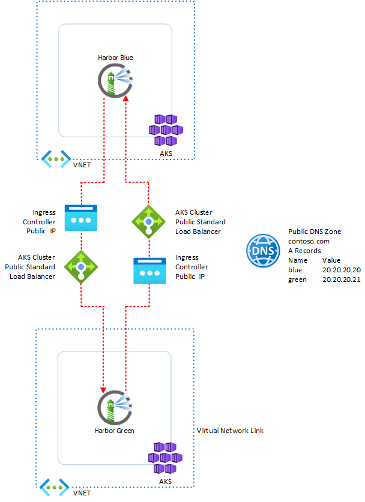

When a Harbor instance running on an AKS cluster in one region communicates with another Harbor instance hosted by another AKS cluster, in the same or a different region, via a public IP address, the communication typically occurs over the public internet. In this scenario, the communication between the two AKS clusters traverses the external network, utilizing public IP addresses and potentially going through various network providers and routers before reaching the destination cluster.

It's important to note that while Microsoft owns and operates a robust global network backbone, called the Azure backbone network, which provides fast and reliable connectivity within the Azure ecosystem, communication between AKS clusters across regions through public `LoadBalancer` Kubernetes services typically does not utilize this internal backbone network. To ensure secure and reliable communication between AKS clusters across regions, you might consider using alternative methods such as [Azure Virtual Network peering](https://learn.microsoft.com/en-us/azure/virtual-network/virtual-network-peering-overview) or [Azure Private Link Service](https://learn.microsoft.com/en-us/azure/private-link/private-link-service-overview) connections. These options provide private network connections over the Azure backbone network, offering lower latency and enhanced security compared to traversing the public internet.

### Harbor Instances communicating via Private IP Address

You can use a network topology using private IP addresses to let two or more Harbor instances located in different AKS clusters communicate with each other over a private and secure channel.  This approach involves configuring ingress controllers to utilize the internal [Azure Standard Load Balancer](https://learn.microsoft.com/en-us/azure/load-balancer/load-balancer-overview) specific to each AKS cluster. The network architecture diagram below illustrates this configuration.

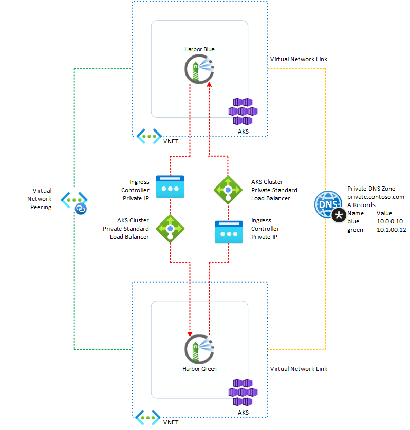

To establish this network topology, the virtual networks hosting the AKS clusters need to be connected using [Azure Virtual Network peering](https://learn.microsoft.com/en-us/azure/virtual-network/virtual-network-peering-overview). Virtual Network peering allows for seamless connection of two or more Azure Virtual Networks, enabling them to function as a single network for connectivity purposes. Traffic between virtual machines in peered virtual networks is routed exclusively through the Microsoft backbone network, ensuring secure and efficient communication.

In this network topology, a global [Azure Private DNS Zone](https://learn.microsoft.com/en-us/azure/dns/private-dns-privatednszone) acts as a reliable and secure DNS service, managing domain name resolution across multiple virtual networks. By associating Private DNS zones with the virtual networks hosting the AKS clusters, you can utilize A records to resolve the hostname of the Harbor instances to their corresponding private IP addresses assigned to the ingress controllers.

Implementing Harbor communication via private IP addresses offers enhanced security and performance compared to the public internet. By leveraging Azure Virtual Network peering and Azure Private DNS zones, you can establish a resilient network infrastructure for seamless communication between Harbor instances in different AKS clusters.

### Harbor Instances communicating via Azure Private Link

To establish secure and private communication between Harbor instances in different AKS clusters, you can configure them to communicate via [Azure Private Link Service](https://learn.microsoft.com/en-us/azure/private-link/private-link-service-overview) connections. The diagram below illustrates this network topology.

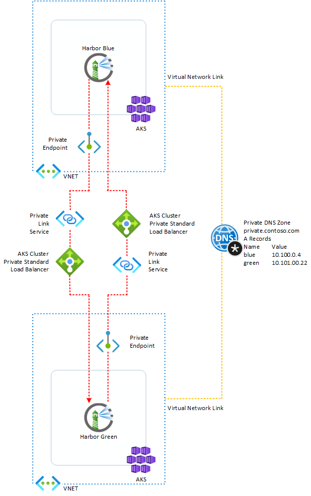

In this network topology, each Harbor instance is exposed through an Azure Private Link Service, utilizing the internal [Azure Standard Load Balancer](https://learn.microsoft.com/en-us/azure/load-balancer/load-balancer-overview) specific to the respective AKS cluster. This setup eliminates the need for [Azure Virtual Network peering](https://learn.microsoft.com/en-us/azure/virtual-network/virtual-network-peering-overview) to connect the virtual networks hosting the AKS clusters. Instead, each Harbor instance uses an [Azure Private Endpoint](https://learn.microsoft.com/en-us/azure/private-link/private-endpoint-overview) within the AKS virtual network to establish secure connectivity to the Private Link Service of another Harbor instance.

To enable DNS resolution across multiple virtual networks, a global [Azure Private DNS Zone](https://learn.microsoft.com/en-us/azure/dns/private-dns-privatednszone) is utilized. This DNS zone provides a reliable and secure DNS service to manage and resolve domain names. By associating the Private DNS zones with the virtual networks hosting the AKS clusters, you can utilize an A record to resolve the name of a remote Harbor Private Link Service to the private IP address of the respective local Private Endpoint.

The use of Azure Private Link ensures secure and direct communication between Harbor instances, keeping the traffic within the Azure backbone network. This topology enhances security and performance, providing a reliable and efficient network infrastructure for the communication between Harbor instances in different AKS clusters.

## Working with Harbor

In Harbor, a project represents a collection of container images. Before pushing images to Harbor, a project must be created. Role-Based Access Control (RBAC) is applied to projects, ensuring that only users with specific roles can perform certain operations.

Harbor supports two types of projects:

- `Public`: This type allows any user to pull images from the project, making it convenient for sharing repositories with others.
- `Private`: Only project members can pull images from a private project, enhancing privacy and access control.

By default, when deploying Harbor, a public project named `library` is created. However, you can create additional projects and assign users to them, enabling them to push and pull image repositories. User access to images is determined by their roles within the project.

The following roles are available in Harbor:

- `Limited Guest`: Limited Guests have restricted read privileges. They can only pull images and are unable to push, view logs, or see other project members. This role is useful for granting limited access to users from different organizations.
- `Guest`: Guests have read-only privileges for a specified project. They can pull and retag images but cannot push.
- `Developer`: Developers have read and write privileges for a project.
- `Maintainer`: Maintainers have elevated permissions beyond developers. They can scan images, view replication jobs, and delete images and Helm charts.
- `ProjectAdmin`: When creating a new project, the creator is assigned the `ProjectAdmin` role. In addition to read-write privileges, ProjectAdmins have management capabilities such as adding and removing members and initiating vulnerability scans.

The image below illustrates the RBAC roles in Harbor:

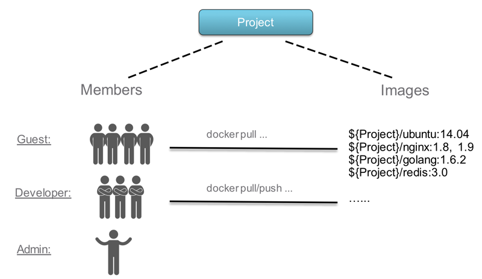

By assigning appropriate roles to users in different projects, you can control their access to image repositories and manage their permissions effectively. For more information on Projects, see the official [Harbor documentation](https://goharbor.io/docs/2.9.0/working-with-projects/project-configuration/).

## Create a New Project

Assuming that you have successfully deployed Harbor to your Azure Kubernetes Service (AKS) cluster and exposed it either inside or outside the virtual network using an ingress controller, such as the [NGINX Ingress controller](https://kubernetes.github.io/ingress-nginx/) or the [Application Gateway for Containers](https://learn.microsoft.com/en-us/azure/application-gateway/for-containers/overview), log in using the administrator credentials. Once logged in, you will see the `Projects` page.

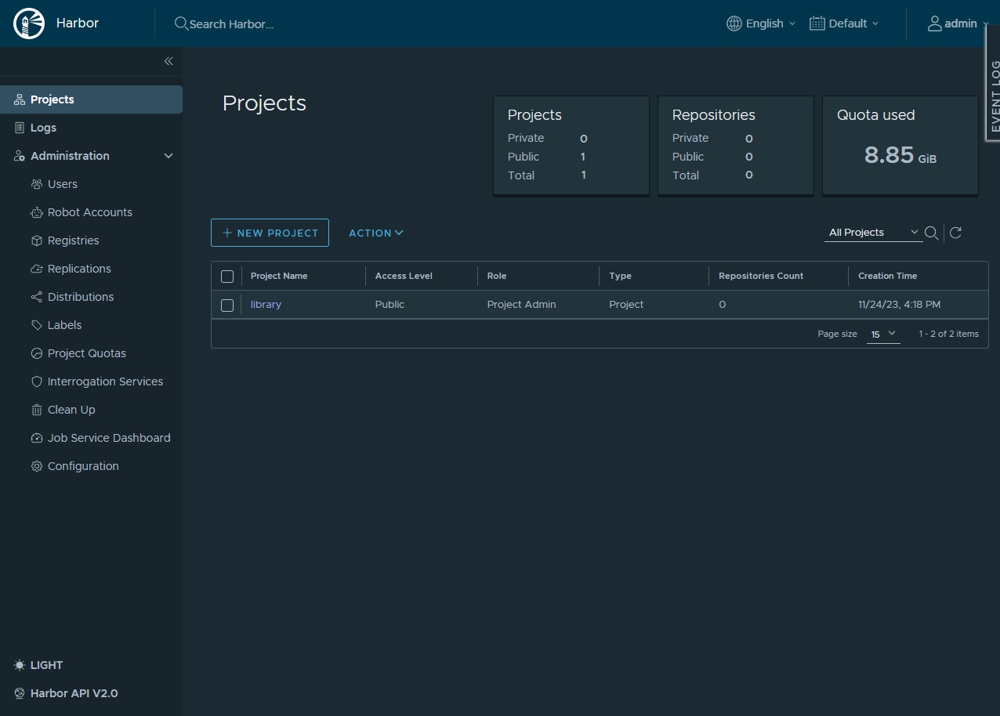

You can proceed as follows to create a new `Project`:

1. Log in to the Harbor interface with an account that has Harbor system administrator privileges.
2. Go to `Projects` and click `New Project`.
3. Provide a name for the project, for example `private`.
4. You have the option to make the project `Public` by checking the corresponding checkbox. If the project is set to `Public`, any user can pull images from it. If you leave the project as `Private`, only members of the project can pull images.
5. Enable the `Proxy Cache` option if you want this project to function as a pull-through cache for a specific target registry instance. Note that Harbor can only act as a proxy for DockerHub, Docker Registry, Harbor itself, AWS ECR, Azure ACR, Google GCR, GitHub GHCR, and JFrog Artifactory registries.
6. Click `OK`.

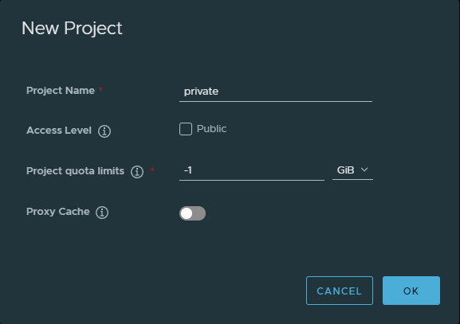

Once the project is created, you can explore various sections such as the summary, repositories, helm charts, members, labels, scanner, P2P preheat, policy, robot accounts, logs, and configuration using the navigation tabs provided. These sections allow you to manage and configure your projects in Harbor, providing granular control over access, scanning, caching, and more.

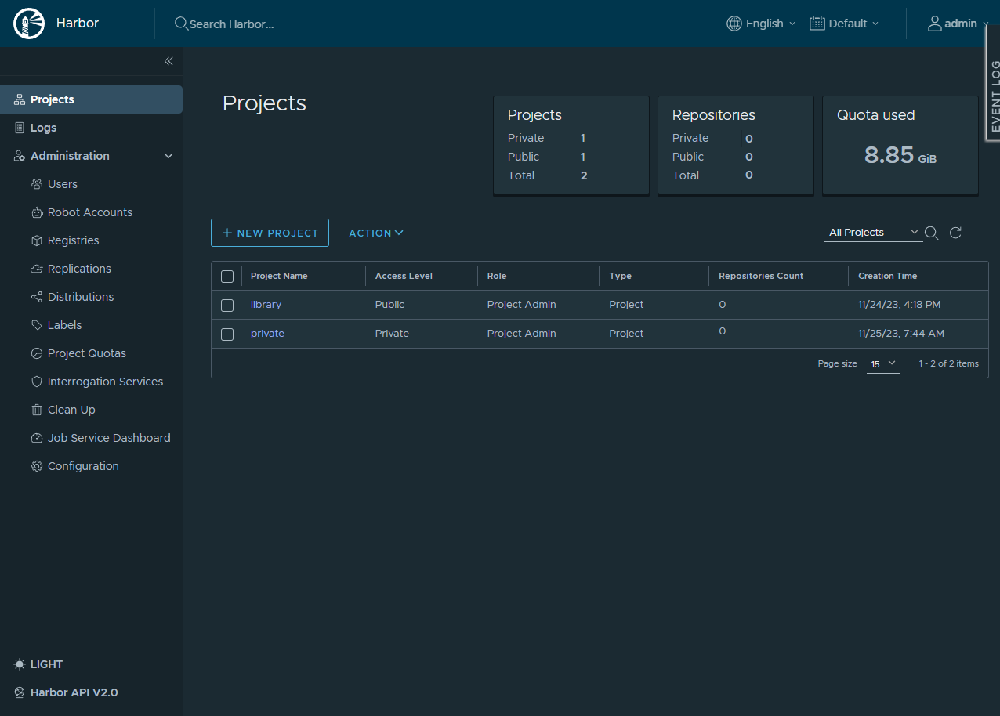

## Create a New User

Proceed as follows to create a new user:

1. Log in to the Harbor interface with an account that has Harbor system administrator privileges.
2. Under `Administration`, go to `Users`.
3. Click `New User`.
4. Enter information about the new user.
   - The username must be unique in the Harbor system
   - The email address must be unique in the Harbor system
   - The password must contain at least 8 characters with 1 lowercase letter, 1 uppercase letter and 1 numeric character

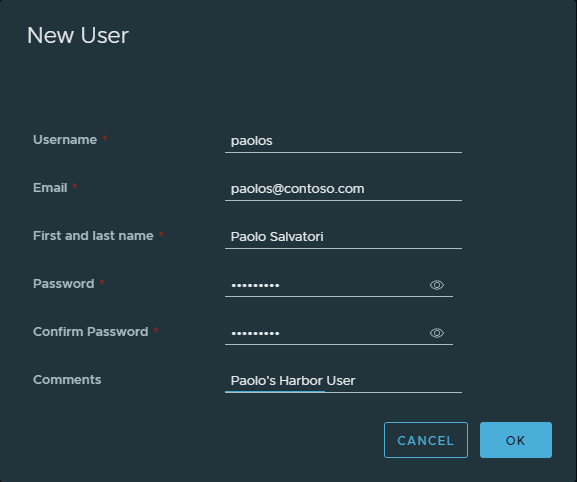

If users forget their password, they need to ask the administrator to [reset their password](https://goharbor.io/docs/2.9.0/administration/managing-users/reset-user-password/). Optionally, you can select a user, then click the `Set as Admin` to assign the administrator role to the user.

[!Set User as Admin](./images/set-user-as-admin.png)

You can proceed as follows to assign a user a role on a `Project`:

1. Go to `Projects` and select a project.
2. Select the `Members` tab.

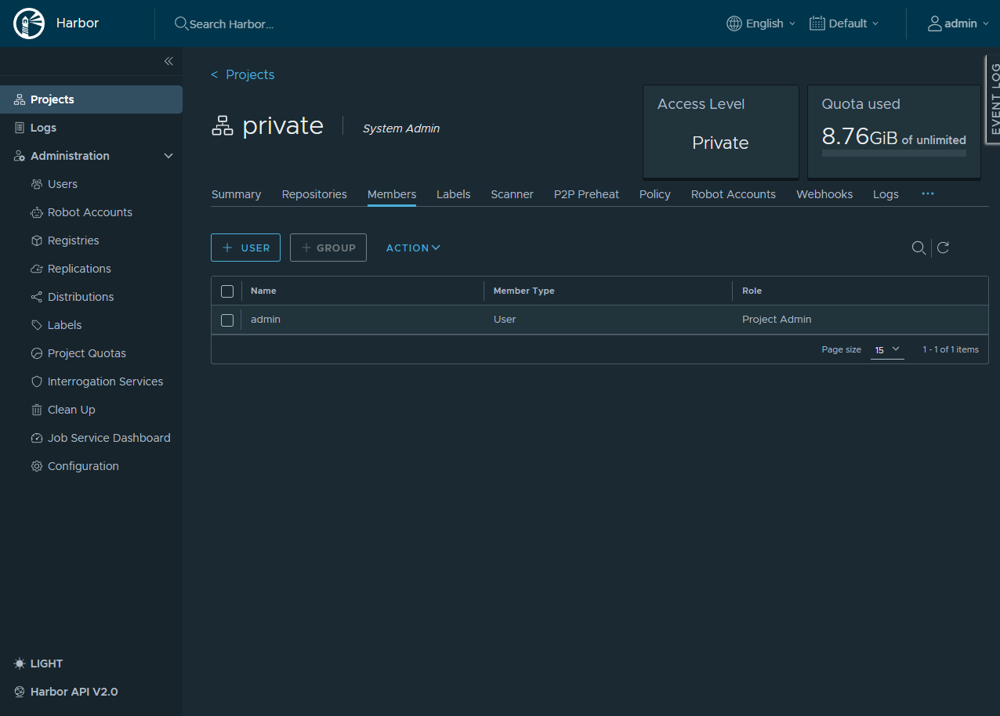

3. Click `User`.
4. Specify the name of an existing user and select a role. For more information, see [User Permissions By Role](https://goharbor.io/docs/2.9.0/administration/managing-users/user-permissions-by-role/).

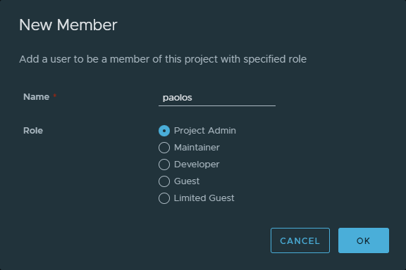

5. Click `OK`.

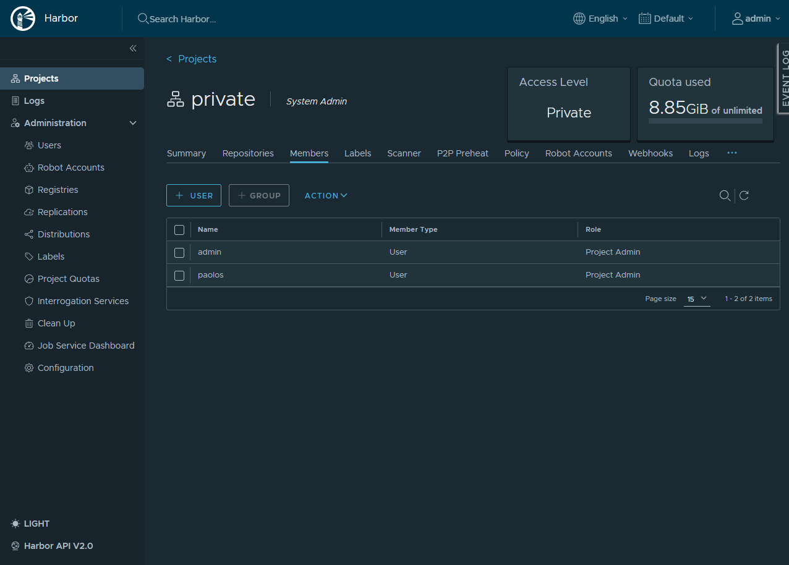

Depending on the selected role, the user will be able to see or edit the repositories in the project, pull or push images, etc. On public projects all users will be able to see the list of repositories, images, image vulnerabilities, Helm charts and Helm chart versions, pull images, retag images (need push permission for destination image), download Helm charts, download Helm chart versions.

## Working with Images in Harbor

In this section, you will learn how to efficiently pull and push container images to Harbor.

### Pushing Images to Harbor

For simplicity, let's assume that the Harbor registry is publicly exposed at `harbor.contoso.com`. Follow these steps to publish a container image to Harbor:

Run the following command to build the container image:

1. Run the following command to build the container image:

```bash
# Build the docker image
docker build -t flaskapp:1.0 -f ./app/Dockerfile ./app
```

2. To access a private project, you need to sign in using the credentials of a Harbor user who has been assigned a role with the `Push Image` permission for the specific library containing the image.

```bash
# Login to Harbor
docker login harbor.contoso.com -u <your-harbor-username> -p <your-harbor-password>
```

3. Tag the Docker image using the format `harbor-hostname/harbor-project/image-name:image-tag`

```bash
# Tag the docker image
docker tag flaskapp:1.0 harbor.contoso.com/private/flaskapp:1.0
```

4. Push the image.

```bash
# Push the docker image
docker push  harbor.contoso.com/private/flaskapp:1.0
```

To push Windows images to your Harbor instance, you also must set your docker daemon to `allow-nondistributable-artifacts`. For more information see [Pushing Windows Images](https://goharbor.io/docs/2.5.0/working-with-projects/working-with-images/pulling-pushing-images/#pushing-windows-images).

Follow these steps to copy the push command for an image in Harbor:

1. Log in to the Harbor interface with an account that has Harbor system administrator privileges.
2. Navigate to the `Projects` section and click on the link to the project that contains the image.
3. Locate the `Push Command` option.
4. Copy the push command in the desired format to the clipboard.

These steps will enable you to easily access and use the push command for the image in Harbor.

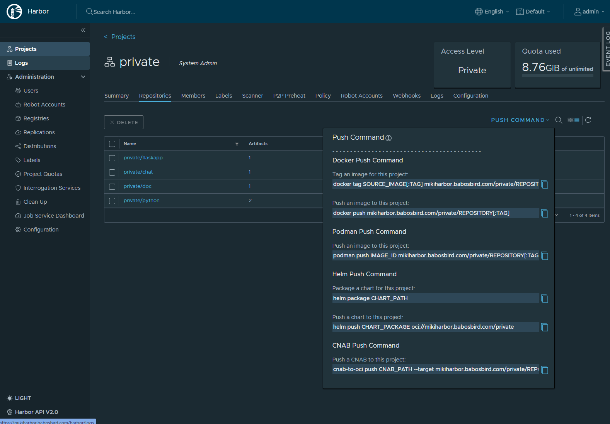

### Pulling Images from Harbor

Follow this steps to pull an image from Harbor:

1. To access a private project, you need to sign in using the credentials of a Harbor user who has been assigned a role with the `Pull Image` permission for the specific library containing the image.

```bash
# Login to Harbor
docker login harbor.contoso.com -u <your-harbor-username> -p <your-harbor-password>
```

2. Pull the image from Harbor:

```bash
# Pull the docker image from Harbor
docker pull  harbor.contoso.com/private/flaskapp:1.0
```

If you don't know the exact tag of the container image to pull, you can proceed as follows:

1. Log in to the Harbor interface with an account that has Harbor system administrator privileges.
2. Navigate to the `Projects` section and click on the link to the project that contains the image.
3. Click the container image link.
4. Select a container image version.
5. Click `Copy Pull Command`.
6. Click `Docker` or `Podman` to copy the pull command in the desired format to the clipboard.

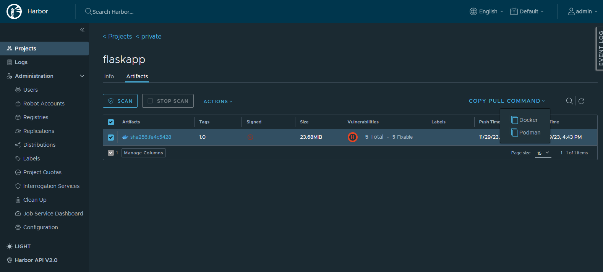

### Using an Image from Harbor

In order to deploy a workload to your Azure Kubernetes Service (AKS) cluster that uses a container image from a private project in Harbor, you need to follow these steps. If you are not familiar with pulling images from a private registry, you can refer to the [Kubernetes documentation](https://kubernetes.io/docs/tasks/configure-pod-container/pull-image-private-registry/) for more information.

#### Log in to Harbor

On your laptop, you must authenticate with Harbor in order to pull an image from a private library. Use the `docker` tool to log in to Harbor. For more information, see [Docker ID accounts](https://docs.docker.com/docker-id/#log-in). You need to sign in using the credentials of a Harbor user who has been assigned a role with the `Pull Image` permission for the specific library containing the image.

```bash
# Login to Harbor
docker login harbor.contoso.com -u <your-harbor-username> -p <your-harbor-password>
```

The login process creates or updates a `config.json` file that contains an authorization token. For more information, see [Kubernetes Interpretation of config.json](https://kubernetes.io/docs/concepts/containers/images#config-json). You can view the contents of the `config.json` file by running the following command:

```bash
cat ~/.docker/config.json
```

The output contains a section similar to this:

```json
{
    "auths": {
        "https://index.docker.io/v1/": {
            "auth": "c3R...zE2"
        }
    }
}
```

`Note:` If you use a Docker credentials store, you won't see that `auth` entry but a `credsStore` entry with the name of the store as value. In that case, you can create a secret directly. See [Create a Secret by providing credentials on the command line](https://kubernetes.io/docs/tasks/configure-pod-container/pull-image-private-registry/#create-a-secret-by-providing-credentials-on-the-command-line).

#### Create a Secret based on existing credentials

A Kubernetes cluster uses the Secret of `kubernetes.io/dockerconfigjson` type to authenticate with a private container registry to pull a container image. If you already ran `docker login`, you can copy that credential into Kubernetes:

```bash
kubectl create secret generic regcred \
    --from-file=.dockerconfigjson=<path/to/.docker/config.json> \
    --type=kubernetes.io/dockerconfigjson
```

If you need more control (for example, to set a namespace or a label on the new secret) then you can customize the secret as follows before storing it.

- Set the name of the data item to `.dockerconfigjson`.
- Use `base64` encode on the Docker configuration file and then paste that string, unbroken as the value for field `data[".dockerconfigjson"]`.
- Set `type` to `kubernetes.io/dockerconfigjson`.

Here is an example:

```yaml
apiVersion: v1
kind: Secret
metadata:
  name: myregistrykey
  namespace: awesomeapps
data:
  .dockerconfigjson: UmVhbGx5IHJlYWxseSByZWVlZWVlZWVlZWFhYWFhYWFhYWFhYWFhYWFhYWFhYWFhYWFhYWxsbGxsbGxsbGxsbGxsbGxsbGxsbGxsbGxsbGxsbGx5eXl5eXl5eXl5eXl5eXl5eXl5eSBsbGxsbGxsbGxsbGxsbG9vb29vb29vb29vb29vb29vb29vb29vb29vb25ubm5ubm5ubm5ubm5ubm5ubm5ubm5ubmdnZ2dnZ2dnZ2dnZ2dnZ2dnZ2cgYXV0aCBrZXlzCg==
type: kubernetes.io/dockerconfigjson
```

If you get the error message `error: no objects passed to create`, it may mean the base64 encoded string is invalid. If you get an error message like `Secret "myregistrykey" is invalid: data[.dockerconfigjson]: invalid value ...`, it means the base64 encoded string in the data was successfully decoded, but could not be parsed as a `.docker/config.json` file.

#### Create a Secret by providing credentials on the command line

Create this Secret, naming it `regcred`:

```bash
kubectl create secret docker-registry regcred \
  --namespace <your-workload-namespace> \
  --docker-server=<your-harbor-hostname> \
  --docker-username=<your-harbor-username> \
  --docker-password=<your-harbor-password> \
  --docker-email=<your-email>
```

where:

- `<your-workload-namespace>` is the workload namespace.
- `<your-harbor-hostname>` is your hostname of your Harbor registry, for example `harbor.contoso.com`.
- `<your-harbor-username>` is your Harbor username.
- `<your-harbor-password>` is your Harbor password.
- `<your-email>` is your Harbor user email.

You have successfully set your Harbor credentials in the cluster as a secret called `regcred`.

`Note:` Typing secrets on the command line may store them in your shell history unprotected, and those secrets might also be visible to other users on your PC during the time that `kubectl` is running.

#### Inspecting the `regcred` Secret

To understand the contents of the `regcred` secret you created, start by viewing the Secret in YAML format:

```shell
kubectl get secret regcred --namespace <your-workload-namespace> --output yaml
```

The output is similar to this:

```yaml
apiVersion: v1
data:
  .dockerconfigjson: eyJhdXRocyI6eyJ0YW5oYXJib3IuYmFib3NiaXJkL...=
kind: Secret
metadata:
  creationTimestamp: "2023-11-24T10:17:42Z"
  name: regcred
  namespace: flaskapp
  resourceVersion: "73013805"
  uid: 42514bad-c471-4083-bf74-b38a1e8010b9
type: kubernetes.io/dockerconfigjson
```

The value of the `.dockerconfigjson` field is a base64 representation of your Harbor credentials in Docker format. To understand what is in the `.dockerconfigjson` field, convert the secret data to a readable format:

```bash
kubectl get secret regcred --output="jsonpath={.data.\.dockerconfigjson}" | base64 --decode
```

The output is similar to this:

```json
{"auths":{"harbor.contoso.com":{"username":"paolos","password":"xxxxxxxxxx","email":"paolos@contoso.com","auth":"YWRta...aW4="}}}
```

To understand what is in the `auth` field, convert the base64-encoded data to a readable format:

```bash
echo "c3R...zE2" | base64 --decode
```

The output, username and password concatenated with a `:`, is similar to this:

```yaml
paolos:xxxxxxxxxxx
```

Notice that the Secret data contains the authorization token similar to your local `~/.docker/config.json` file. You have successfully set your Harbor credentials as a Secret called `regcred` in the cluster.

#### Create a Deployment that uses a Harbor image

Below you can see the YAML manifest of a Kubernetes deployment that pulls a container image from a private library of an Harbor registry usig the `regcred` secret.

```yaml
apiVersion: apps/v1
kind: Deployment
metadata:
  name: flaskapp
  labels:
    app: flaskapp
spec:
  replicas: 2
  selector:
    matchLabels:
      app: flaskapp
  strategy:
    rollingUpdate:
      maxSurge: 1
      maxUnavailable: 1
  minReadySeconds: 5
  template:
    metadata:
      labels:
        app: flaskapp
    spec:
      topologySpreadConstraints:
      - maxSkew: 1
        topologyKey: topology.kubernetes.io/zone
        whenUnsatisfiable: ScheduleAnyway
        labelSelector:
          matchLabels:
            app: flaskapp
      - maxSkew: 1
        topologyKey: kubernetes.io/hostname
        whenUnsatisfiable: ScheduleAnyway
        labelSelector:
          matchLabels:
            app: flaskapp
      nodeSelector:
        "kubernetes.io/os": linux
      containers:
      - name: flaskapp
        image: harbor.contoso.com/private/flaskapp:1.0
        imagePullPolicy: Always
        resources:
          requests:
            memory: "32Mi"
            cpu: "100m"
          limits:
            memory: "64Mi"
            cpu: "200m"
        ports:
        - containerPort: 8888
        livenessProbe:
          httpGet:
            path: /
            port: 8888
          failureThreshold: 1
          initialDelaySeconds: 60
          periodSeconds: 30
          timeoutSeconds: 5
        readinessProbe:
          httpGet:
            path: /
            port: 8888
          failureThreshold: 1
          initialDelaySeconds: 60
          periodSeconds: 30
          timeoutSeconds: 5
        startupProbe:
          httpGet:
            path: /
            port: 8888
          failureThreshold: 1
          initialDelaySeconds: 60
          periodSeconds: 30
          timeoutSeconds: 5
        env:
        - name: NODE_NAME
          valueFrom:
            fieldRef:
              fieldPath: spec.nodeName
        - name: POD_NAME
          valueFrom:
            fieldRef:
              fieldPath: metadata.name
        - name: NAMESPACE
          valueFrom:
            fieldRef:
              fieldPath: metadata.namespace
        - name: POD_IP
          valueFrom:
            fieldRef:
              fieldPath: status.podIP
        - name: SERVICE_NAME
          value: flaskapp
      imagePullSecrets:
      - name: regcred
```

To pull the image from a private registry, Kubernetes needs credentials. The `imagePullSecrets` field in the YAML manifest specifies that Kubernetes should get the credentials from a secret named `regcred`. Create a Kubernetes deployment that uses the `regcred` secret located in the same namespace, and verify that its pods are running:

```shell
kubectl apply -f deployment.yaml --namespace <your-workload-namespace>
```

In case the pods or your deployment fail to start with the status `ImagePullBackOff`, view the Pod events:

```shell
kubectl describe pod flaskapp-7f5df9c48d-dhn67
```

If you then see an event with the reason set to `FailedToRetrieveImagePullSecret`, Kubernetes can't find a secret with the given name, `regcred` in this example. If you specify that a pod needs image pull credentials, the kubelet checks that it can access that secret before attempting to pull the image. Make sure that the secret you have specified exists, and that its name is spelled properly.

```shell
Events:
  ...  Reason                           ...  Message
       ------                                -------
  ...  FailedToRetrieveImagePullSecret  ...  Unable to retrieve some image pull secrets (<regcred>); attempting to pull the image may not succeed.
```

## Create a Registry Endpoint in Harbor

Harbor registries can be used to replicate images with other Harbor instances or external container registries. Replication enables synchronization of container images between multiple registries, providing redundancy, disaster recovery, and load balancing. Here's how you can use Harbor to replicate images:

1. `Create Replication Endpoints`: You start by creating replication endpoints in Harbor. These endpoints define the external registries or other Harbor instances that you want to replicate images with. You can specify the type of registry (Harbor or non-Harbor) and provide the necessary authentication details.
2. `Configure Replication Policies`: After creating the endpoints, you can define replication policies in Harbor. These policies determine which projects and repositories are replicated to the specified endpoints. You can choose to replicate all repositories or specific ones based on certain criteria, such as project name, repository name, or image tags.
3. `Schedule Replication`: Once the replication policies are set up, you can schedule when and how often replication should occur. You can configure the frequency, timing, and other parameters for replication jobs. Harbor allows you to set up one-time replication or recurring ones at regular intervals.
4. `Monitor Replication Status`: Harbor provides monitoring and logging capabilities to track the replication process. You can view the replication status, track any errors or warnings, and ensure that the images are successfully replicated to the specified endpoints. These insights help in troubleshooting and maintaining the replication process.

By leveraging Harbor's replication feature, you can establish a resilient and distributed infrastructure for your container images. This enables seamless collaboration and sharing of images across different teams, locations, or cloud environments. It also allows you to integrate Harbor with external registries like Docker Hub, ECR, Azure Container Registry, etc., facilitating a streamlined and efficient workflow for container image management.

To replicate image repositories from one instance of Harbor to another Harbor or non-Harbor registry, you need to create replication endpoints. Here's how:

1. Go to `Registries` and click the `+ New Endpoint` button.

   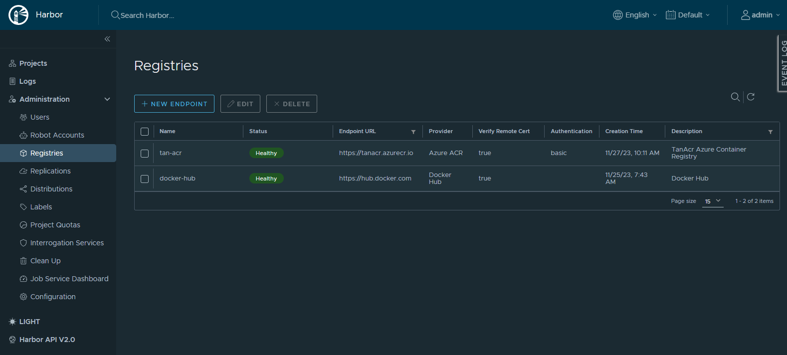

2. For `Provider`, select the type of registry to set up as a replication endpoint from the drop-down menu. The supported non-Harbor registries are:

   - [Docker Hub](https://hub.docker.com/)
   - [Docker registry](https://docs.docker.com/registry/)
   - [AWS Elastic Container Registry](https://aws.amazon.com/ecr/)
   - [Azure Container Registry (ACR)](https://azure.microsoft.com/en-us/services/container-registry/)
   - [Ali Cloud Container Registry](https://intl.aliyun.com/product/container-registry)
   - [Google Container Registry](https://cloud.google.com/container-registry)
   - [Huawei SWR](https://www.huaweicloud.com/en-us/product/swr.html)
   - [Artifact Hub](https://artifacthub.io/) (Support added in v2.0.4)
   - [Gitlab](https://gitlab.com/)
   - [Quay.io](https://quay.io/)
   - [Jfrog Artifactory](https://jfrog.com/artifactory/)

   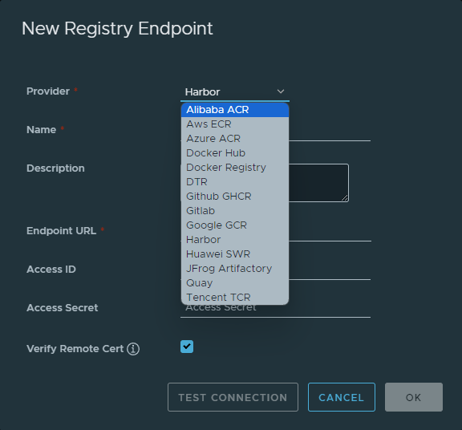

3. Enter a suitable name and description for the new replication endpoint.
4. Enter the full URL of the registry to set up as a replication endpoint. For example, to replicate to another Harbor instance, enter `https://harbor_instance_address:443`. Make sure the registry exists and is running before creating the endpoint.
5. Enter the Access ID and Access Secret for the endpoint registry instance. Use an account with the appropriate privileges on that registry, or an account with write permission on the corresponding project in a Harbor registry. Note:

   - Azure ACR adapter should use the username and password of an ACR token. For more information on how to create tokens and scope maps to manage access to specific repositories in your Azure Container Registry (ACR), see [Create a token with repository-scoped permissions](https://learn.microsoft.com/en-us/azure/container-registry/container-registry-repository-scoped-permissions).
   - AWS ECR adapters should use an authentication token. For more information, see [Private registry authentication](https://docs.aws.amazon.com/AmazonECR/latest/userguide/registry_auth.html).
   - Google GCR adapters should use the entire JSON key generated in the service account. The namespace should start with the project ID. For more information, see [Create and delete service account keys](https://cloud.google.com/iam/docs/keys-create-delete).

6. Optionally, select the `Verify Remote Cert` check box. Deselect it if the remote registry uses a self-signed or untrusted certificate.
7. Click `Test Connection`.
8. If the connection test is successful, click `OK`.

You can list, add, edit, and delete registries under `Administration` -> `Registries`. Only registries that are not referenced by any rules can be deleted.

### Create a Registry Endpoint to another Harbor Instance

If you want to create a registry endpoint to another Harbor instance, you can follow these steps:

1. Go to `Registries` and click the `+ New Endpoint` button.
2. From the `Provider` dropdown, select `Harbor`.
3. Provide a suitable name and description for the new replication endpoint.
4. Enter the full URL of the Harbor registry that you want to set up as the replication endpoint. For example, if you want to replicate to another Harbor instance, enter `https://harbor_instance_address:443`. Make sure the registry is already running before creating the endpoint.
5. Enter the username and password of a user in the remote Harbor registry with the necessary privileges.
6. If needed, select the `Verify Remote Cert` checkbox. You can deselect it if the remote registry uses a self-signed or untrusted certificate.
7. Click on `Test Connection` to verify the connection.
8. If the connection test is successful, click `OK`.

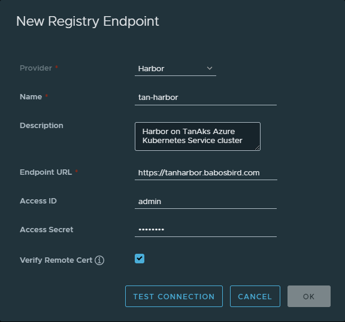

### Create a Registry Endpoint to Docker Hub

Proceed as follows to create a registry endpoint to Docker Hub:

1. Go to `Registries` and click the `+ New Endpoint` button.
2. From the `Provider` dropdown, select `Docker Hub`.
3. Provide a suitable name and description for the new replication endpoint.
4. Enter the username and password of a Docker Hub user with the required privileges. If you are only planning to use this registry endpoint only for pulling public images from Docker Hub, you can leave these fields blank.
5. Click on `Test Connection` to verify the connection.
6. If the connection test is successful, click `OK`.

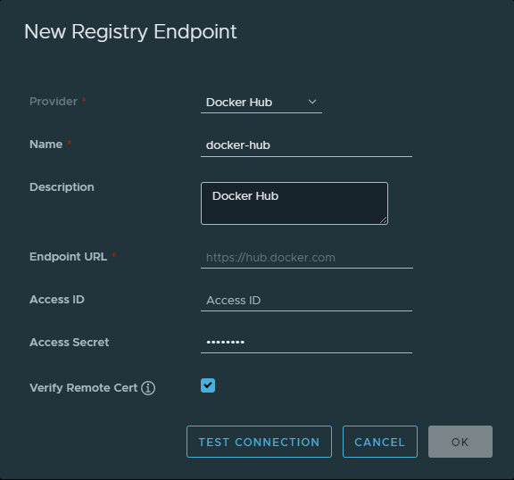

### Create a Registry Endpoint to Azure Container Registry (ACR)

Before creating a registry endpoint for your Azure Container Registry, you need to create a token and a scope map to let Harbor access a subset of repositories in your container registry. By creating tokens, a registry owner can provide users or services with scoped, time-limited access to repositories to pull or push images or perform other actions.

A `token` along with a generated password lets the user authenticate with the registry. You can set an expiration date for a token password, or disable a token at any time. After authenticating with a token, Harbor can perform one or more `actions` scoped to one or more repositories.

  |Action  |Description  | Example |
  |---------|---------|--------|
  |`content/delete`    | Remove data from the repository  | Delete a repository or a manifest |
  |`content/read`     |  Read data from the repository |  Pull an artifact |
  |`content/write`     |  Write data to the repository     | Use with `content/read` to push an artifact |
  |`metadata/read`    | Read metadata from the repository   | List tags or manifests |
  |`metadata/write`     |  Write metadata to the repository  | Enable or disable read, write, or delete operations |

A `scope map` groups the repository permissions you apply to a token and can reapply to other tokens. Every token is associated with a single scope map. With a scope map, you can:

- Configure multiple tokens with identical permissions to a set of repositories.
- Update token permissions when you add or remove repository actions in the scope map, or apply a different scope map.

Azure Container Registry also provides several system-defined scope maps you can apply when creating tokens. The permissions of system-defined scope maps apply to all repositories in your registry.The individual `actions` corresponds to the limit of [Repositories per scope map.](https://learn.microsoft.com/en-us/azure/container-registry/container-registry-skus)

The following image shows the relationship between tokens and scope maps.

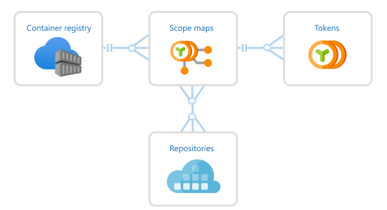

You can use following script to create a scope map and a token.

```bash
#!/bin/bash

# Variables
acrName="TanAcr"
acrResourceGroupName="TanRG"
acrScopeMapName="harbor-scope-map"
acrUsername="harbor"
repositories=("chat" "doc")

# Checck if an Azure Container Registry scope map already exists
echo "Checking if [$acrScopeMapName] scope map actually exists in the [$acrName] container registry..."
az acr scope-map show \
  --name $acrScopeMapName \
  --registry $acrName \
  --resource-group $acrResourceGroupName &>/dev/null

if [[ $? != 0 ]]; then
  echo "No [$acrScopeMapName] scope map actually exists in the [$acrName] container registry"
  echo "Creating [$acrScopeMapName] scope map in the [$acrName] container registry..."

  # Create the Azure Container Registry scope map
  az acr scope-map create \
    --name $acrScopeMapName \
    --registry $acrName \
    --resource-group $acrResourceGroupName \
    --description "Scope map for Harbor" &>/dev/null

  if [[ $? == 0 ]]; then
    echo "[$acrScopeMapName] scope map successfully created in the [$acrName] container registry"
  else
    echo "Failed to create [$acrScopeMapName] scope map in the [$acrName] container registry"
    exit
  fi

  # Add the repositories to the Azure Container Registry scope map
  for repository in ${repositories[@]}; do
    echo "Adding [$repository] repository to the [$acrScopeMapName] scope map in the [$acrName] container registry..."
    az acr scope-map update \
      --name $acrScopeMapName \
      --registry $acrName \
      --resource-group $acrResourceGroupName \
      --add-repository $repository content/read content/write metadata/read metadata/write &>/dev/null

    if [[ $? == 0 ]]; then
      echo "[$repository] repository successfully added to the [$acrScopeMapName] scope map in the [$acrName] container registry"
    else
      echo "Failed to add [$repository] repository to the [$acrScopeMapName] scope map in the [$acrName] container registry"
      exit
    fi
  done
else
  echo "[$acrScopeMapName] scope map already exists in the [$acrName] container registry"
fi

# Check if the token already exists
echo "Checking if [$acrUsername] token actually exists in the [$acrName] container registry..."
az acr token show \
  --name $acrUsername \
  --registry $acrName \
  --resource-group $acrResourceGroupName &>/dev/null

if [[ $? != 0 ]]; then
  echo "No [$acrUsername] token actually exists in the [$acrName] container registry"
  echo "Creating [$acrUsername] token in the [$acrName] container registry..."

  # Create the token
  password=$(az acr token create \
    --name $acrUsername \
    --registry $acrName \
    --resource-group $acrResourceGroupName \
    --scope-map $acrScopeMapName \
    --query "credentials.passwords[?name=='password1'].value" \
    --output tsv \
    --only-show-errors)

  if [[ $? == 0 ]]; then
    echo "[$acrUsername] token successfully created in the [$acrName] container registry"
  else
    echo "Failed to create [$acrUsername] token in the [$acrName] container registry"
    exit
  fi
else
  echo "[$acrUsername] token already exists in the [$acrName] container registry"
fi

# Displaying the token
echo "Username: $acrUsername"
echo "Token: $password"
```

Once you created a token to let Harbor access a subset of ACR repositories, you can proceed as follows to create a registry endpoint to the Azure Container Registry resource:

1. Go to `Registries` and click the `+ New Endpoint` button.
2. From the `Provider` dropdown, select `Azure ACR`.
3. Provide a suitable name and description for the new replication endpoint.
4. Enter `https://<acr-login-server>`, for example `https://contoso.azurecr.io`
5. Enter use the username and password of an [ACR token](https://learn.microsoft.com/en-us/azure/container-registry/container-registry-repository-scoped-permissions) with the necessary privileges on repositories.
6. If needed, select the `Verify Remote Cert` checkbox. You can deselect it if the remote registry uses a self-signed or untrusted certificate.
7. Click on `Test Connection` to verify the connection.
8. If the connection test is successful, click `OK`.

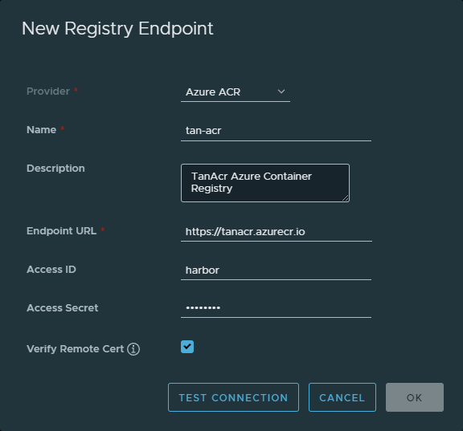

## Create a Replication Rule

Once you created a registry endpoint, you can create one or more replication rulee as follows:

1. Log in to the Harbor interface with an account that has Harbor system administrator privileges.
2. Expand the `Administration` section and select `Replications`.

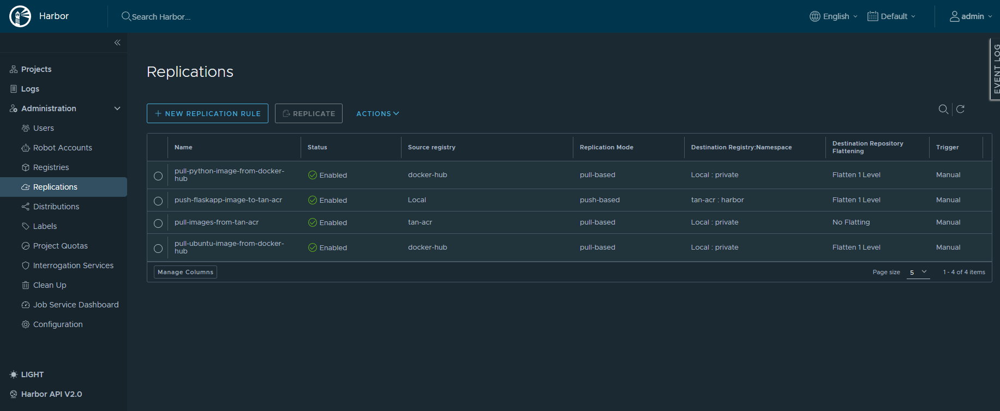

3. Click `New Replication Rule`.
4. Provide a name and description for the replication rule.
5. Choose between `Push-based` or `Pull-based` replication, depending on the desired direction, to or from the remote registry.

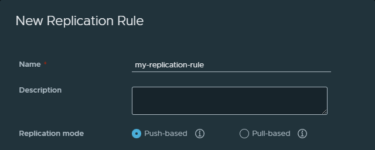

6. If you are setting up a Pull-based replication rule, use the `Source Registry` drop-down menu to select from the configured replication endpoints.
7. Use the `Source resource filter` options to filter the artifacts to be replicated (*):
   
   - `Name`: Enter an artifact name or fragment to replicate resources with a specific name.
   - `Tag`: Enter a tag name or fragment to replicate resources with a particular tag. You can also specify matching/excluding for this filter.
   - `Label`: Select from available labels to replicate resources with a specific label. You can also specify matching/excluding for this filter.
   - `Resource`: Choose whether to replicate images, artifacts, or both.

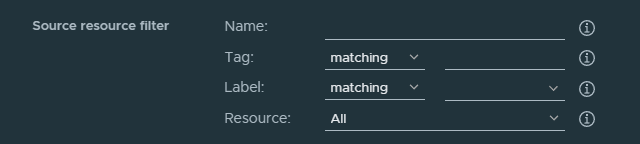

  
8. If you are setting up a Push-based replication rule, use the `Destination Registry` drop-down menu to select from the configured replication endpoints.
9. For `Destination Namespace`, enter the name of the namespace where you want to replicate resources. If left empty, resources will be placed in the same namespace as in the source registry.
10. Use the `Destination Flattening` drop-down to choose how you want Harbor to handle the image hierarchy when replicating images. Select the desired option based on your preference.

    - `Flatten All Levels`: Remove all hierarchy from the replicated image.
    - `No Flattening`: Maintain the same hierarchy when replicating.
    - `Flattening 1 level`: Remove one level from the image hierarchy.
    - `Flattening 2 levels`: Remove two levels from the image hierarchy.
    - `Flattening 3 levels`: Remove three levels from the image hierarchy.

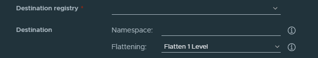

11. Use the `Trigger Mode` drop-down to select when and how the replication rule runs.
      - `Manual`: Replicate the resources manually when needed. Deletion operations are not replicated.
      - `Scheduled`: Replicate the resources periodically by defining a cron job. Deletion operations are not replicated.
      - `Event Based`: Replicate resources immediately when a new resource is pushed or retagged. If you select the `Delete remote resources when locally deleted` option, artifacts deleted locally will also be deleted from the replication destination.

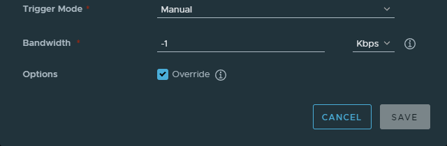

12. Optionally, set the maximum network bandwidth for each replication task using the `Bandwidth` option. Please take into account the number of concurrent executions, keeping in mind that the default value is 10 for each job-service pod. The bandwidth unit is kilobytes per second (-1 stands for unlimited bandwidth). Llimiting the bandwidth too much and stopping the replication job might result in a long delay before the job worker can run a new job.
13. Optionally, select the `Override` checkbox to force replicated resources to replace resources at the destination with the same name.
14. Optionally, select the `Copy by chunk` checkbox to enable copying the artifact blobs by chunks. This feature is currently supported only when the source and destination registries are both Harbor. For other registry types, you can enable it manually by calling the Harbor API. The official support for copy by chunk between Harbor and other registry types has not been verified. The default chunk size is 10MB, but you can override it by setting the `REPLICATION_CHUNK_SIZE` environment variable in the jobservice. For example, to set a chunk size of 10MB, you would set `REPLICATION_CHUNK_SIZE=10485760`.
15. Click `Save` to create the replication rule.

(*) Note that certain patterns are supported for name and tag filters, such as `*`, ```, `?`, and `{alt1,…}`. Please refer to the table in the original text for examples. For more information, see [Creating a Replication Rule](https://goharbor.io/docs/2.9.0/administration/configuring-replication/create-replication-rules/).

### Create a Pull Replication Rule from Docker Hub

You can proceed as follows to create a replication rule to pull an official image, for example the latest version of the [ubuntu](https://hub.docker.com/_/ubuntu) image, from [Docker Hub](https://hub.docker.com/):

1. Log in to the Harbor interface with a Harbor system administrator account.
2. Go to the `Administration` section and select `Replications`.
3. Click `New Replication Rule`.
4. Provide a name and description for the rule.
5. Choose `Pull-based` replication.
6. Select `Docker Hub` as the `Source Registry`.
7. Use the `Source resource filter` options to filter the artifacts to be replicated:

   - `Name`: Enter an artifact name or fragment to replicate resources with a specific name. You must add `library` if you want to replicate the official artifacts of `Docker Hub`. For example, `library/ubuntu` matches the official [ubuntu](https://hub.docker.com/_/ubuntu) image. As noticed in the previous section, you can also use wilcard characters in the name and tag.
   - `Tag`: Enter a tag name or fragment to replicate resources with a particular tag, for example `latest`.

8. For `Destination Namespace`, enter the name of the name of the project where you want to replicate resources, for example `private`.
9. Use the `Destination Flattening` drop-down to choose how you want Harbor to handle the image hierarchy when replicating images. Select the desired option based on your preference.

    - `Flatten All Levels`: Remove all hierarchy from the replicated image.
    - `No Flattening`: Maintain the same hierarchy when replicating.
    - `Flattening 1 level`: Remove one level from the image hierarchy.
    - `Flattening 2 levels`: Remove two levels from the image hierarchy.
    - `Flattening 3 levels`: Remove three levels from the image hierarchy.

10. Use the `Trigger Mode` drop-down to select when and how the replication rule runs.

      - `Manual`: Replicate the resources manually when needed. Deletion operations are not replicated.
      - `Scheduled`: Replicate the resources periodically by defining a cron job. Deletion operations are not replicated.
      - `Event Based`: Replicate resources immediately when a new resource is pushed or retagged. If you select the `Delete remote resources when locally deleted` option, artifacts deleted locally will also be deleted from the replication destination.

11. Optionally, set the maximum network bandwidth for each replication task.
12. Optionally, enable the `Override` checkbox to replace replicated resources with the same name at the destination.
13. Optionally, enable the `Copy by chunk` checkbox to copy artifact blobs in chunks (only supported for Harbor-to-Harbor replication).
14. Click `Save` to create the replication rule.

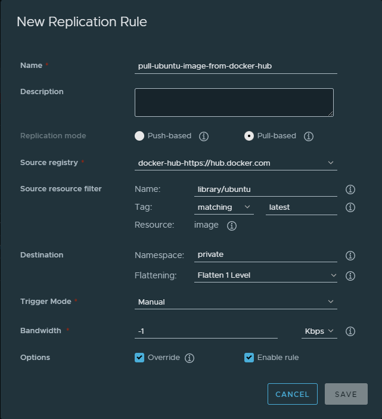

### Create a Pull Replication Rule from another Harbor Instance

You can proceed as follows to create a replication rule to pull a container image from another Harbor instance:

1. Log in to the Harbor interface with a Harbor system administrator account.
2. Go to the `Administration` section and select `Replications`.
3. Click `New Replication Rule`.
4. Provide a name and description for the rule.
5. Choose `Pull-based` replication.
6. Select the other Harbor instance as the `Source Registry`.
7. Use the `Source resource filter` options to filter the artifacts to be replicated:

   - `Name`: Enter an artifact name or fragment to replicate resources with a specific name, for example `private/flaskapp`, where `private` is the name of the project containing the image in the source Harbor.
   - `Tag`: Enter a tag name or fragment to replicate resources with a particular tag, for example `*` to pull all the versions.
   - `Label`: Select from available labels to replicate resources with a specific label. You can also specify matching/excluding for this filter.
   - `Resource`: Choose whether to replicate images, artifacts, or both.

8. For `Destination Namespace`, enter the name of the name of the project where you want to replicate resources, for example `private`.
9. Use the `Destination Flattening` drop-down to choose how you want Harbor to handle the image hierarchy when replicating images. Select the desired option based on your preference.

    - `Flatten All Levels`: Remove all hierarchy from the replicated image.
    - `No Flattening`: Maintain the same hierarchy when replicating.
    - `Flattening 1 level`: Remove one level from the image hierarchy.
    - `Flattening 2 levels`: Remove two levels from the image hierarchy.
    - `Flattening 3 levels`: Remove three levels from the image hierarchy.

10. Use the `Trigger Mode` drop-down to select when and how the replication rule runs.

      - `Manual`: Replicate the resources manually when needed. Deletion operations are not replicated.
      - `Scheduled`: Replicate the resources periodically by defining a cron job. Deletion operations are not replicated.
      - `Event Based`: Replicate resources immediately when a new resource is pushed or retagged. If you select the `Delete remote resources when locally deleted` option, artifacts deleted locally will also be deleted from the replication destination.

11. Optionally, set the maximum network bandwidth for each replication task.
12. Optionally, enable the `Override` checkbox to replace replicated resources with the same name at the destination.
13. Optionally, enable the `Copy by chunk` checkbox to copy artifact blobs in chunks (only supported for Harbor-to-Harbor replication).
14. Click `Save` to create the replication rule.

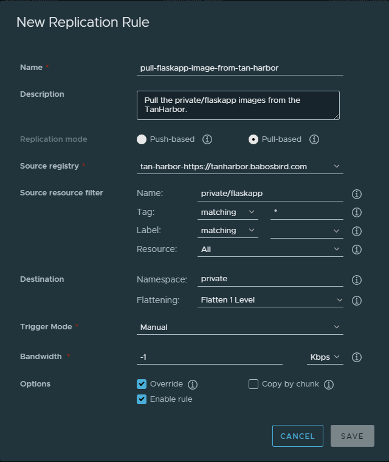

### Create a Pull Replication Rule from Azure Container Registry (ACR)

You can proceed as follows to create a replication rule to pull a container image from an [Azure Container Registry (ACR)](https://azure.microsoft.com/en-us/services/container-registry/) resource:

1. Log in to the Harbor interface with a Harbor system administrator account.
2. Go to the `Administration` section and select `Replications`.
3. Click `New Replication Rule`.
4. Provide a name and description for the rule.
5. Choose `Pull-based` replication.
6. Select the [Azure Container Registry (ACR)](https://azure.microsoft.com/en-us/services/container-registry/) as the `Source Registry`.
7. Use the `Source resource filter` options to filter the artifacts to be replicated:

- `Name`: Enter an artifact name or fragment to replicate resources with a specific name, for example `private/flaskapp`, where `private` is the name of the project containing the image in the source Harbor.
- `Tag`: Enter a tag name or fragment to replicate resources with a particular tag, for example `**` to pull all the versions.

8. For `Destination Namespace`, enter the name of the name of the project where you want to replicate resources, for example `private`.
9. Use the `Destination Flattening` drop-down to choose how you want Harbor to handle the image hierarchy when replicating images. Select the desired option based on your preference, for example `No Flattening` to maintain the same hierarchy when replicating the images.
10. Use the `Trigger Mode` drop-down to select when and how the replication rule runs.
11. Optionally, set the maximum network bandwidth for each replication task.
12. Optionally, enable the `Override` checkbox to replace replicated resources with the same name at the destination.
13. Optionally, enable the `Copy by chunk` checkbox to copy artifact blobs in chunks (only supported for Harbor-to-Harbor replication).
14. Click `Save` to create the replication rule.

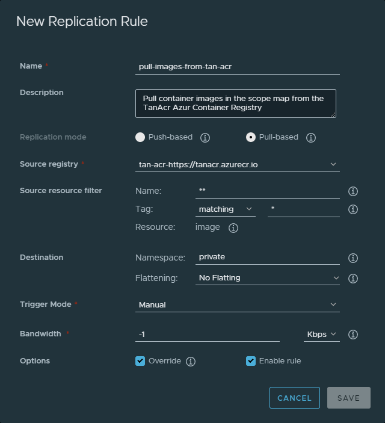

### Create a Push Replication Rule to Azure Container Registry (ACR)

You can proceed as follows to create a replication rule to push a container image to an [Azure Container Registry (ACR)](https://azure.microsoft.com/en-us/services/container-registry/) resource:

1. Log in to the Harbor interface with an account that has Harbor system administrator privileges.
2. Expand the `Administration` section and select `Replications`.
3. Click `New Replication Rule`.
4. Provide a name and description for the replication rule.
5. Choose `Push-based` replication.
6. Use the `Source resource filter` options to filter the artifacts to be replicated:

   - `Name`: Enter an artifact name or fragment to replicate resources with a specific name, for example `private/flaskapp`, where `private` is the name of the project containing the image in the source Harbor.
   - `Tag`: Enter a tag name or fragment to replicate resources with a particular tag, for example `**` to push all the versions.
   - `Label`: Select from available labels to replicate resources with a specific label. You can also specify matching/excluding for this filter.
   - `Resource`: Choose whether to replicate images, artifacts, or both.

7. Use the `Destination Registry` drop-down menu to select the destination [Azure Container Registry (ACR)](https://azure.microsoft.com/en-us/services/container-registry/).
8. For `Destination Namespace`, enter the name of the ACR repository where you want to replicate the artifacts. 
9. Use the `Destination Flattening` drop-down to choose how you want Harbor to handle the image hierarchy when replicating images. Select the desired option based on your preference.

    - `Flatten All Levels`: Remove all hierarchy from the replicated image.
    - `No Flattening`: Maintain the same hierarchy when replicating.
    - `Flattening 1 level`: Remove one level from the image hierarchy.
    - `Flattening 2 levels`: Remove two levels from the image hierarchy.
    - `Flattening 3 levels`: Remove three levels from the image hierarchy.

10. Use the `Trigger Mode` drop-down to select when and how the replication rule runs.
      - `Manual`: Replicate the resources manually when needed. Deletion operations are not replicated.
      - `Scheduled`: Replicate the resources periodically by defining a cron job. Deletion operations are not replicated.
      - `Event Based`: Replicate resources immediately when a new resource is pushed or retagged. If you select the `Delete remote resources when locally deleted` option, artifacts deleted locally will also be deleted from the replication destination.

11. Optionally, set the maximum network bandwidth for each replication task using the `Bandwidth` option. Please take into account the number of concurrent executions, keeping in mind that the default value is 10 for each job-service pod. The bandwidth unit is kilobytes per second (-1 stands for unlimited bandwidth). Llimiting the bandwidth too much and stopping the replication job might result in a long delay before the job worker can run a new job.
12. Optionally, select the `Override` checkbox to force replicated resources to replace resources at the destination with the same name.
13. Optionally, select the `Copy by chunk` checkbox to enable copying the artifact blobs by chunks. This feature is currently supported only when the source and destination registries are both Harbor. For other registry types, you can enable it manually by calling the Harbor API. The official support for copy by chunk between Harbor and other registry types has not been verified. The default chunk size is 10MB, but you can override it by setting the `REPLICATION_CHUNK_SIZE` environment variable in the jobservice. For example, to set a chunk size of 10MB, you would set `REPLICATION_CHUNK_SIZE=10485760`.
14. Click `Save` to create the replication rule.

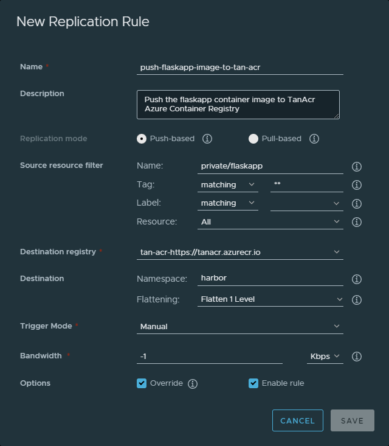

## Import Images into Azure Container Registry (ACR) from Harbor

As shown in the following script, you can use the [az acr import](https://learn.microsoft.com/en-us/cli/azure/acr#az_acr_import) command to import container images from Harbor to a repository named `harbor` in your [Azure Container Registry (ACR)](https://azure.microsoft.com/en-us/services/container-registry/). For more information, see [Import container images to a container registry](https://learn.microsoft.com/en-us/azure/container-registry/container-registry-import-images?tabs=azure-cli).

```bash
#!/bin/bash

# Variables
acrName="TanAcr"
acrResourceGroupName="TanRG"
importProject="private"
importRepositories=("ubuntu:latest" "python:latest")
harborHostname="harbor.contoso.com"
harborAdminUsername="admin"
harborAdminPassword="Passw@rd1!"

# Import images from Harbor into Azure Container Registry
for repository in ${importRepositories[@]}; do
  echo "Importing [$repository] repository from the [$harborHostname] Harbor into the [$acrName] container registry..."
  az acr import \
    --name $acrName \
    --resource-group $acrResourceGroupName \
    --source $harborHostname/$importProject/$repository \
    --image harbor/$repository \
    --username $harborAdminUsername \
    --password $harborAdminPassword \
    --force &>/dev/null

  if [[ $? == 0 ]]; then
    echo "[$repository] repository successfully imported from the [$harborHostname] Harbor into the [$acrName] container registry"
  else
    echo "Failed to import [$repository] repository from the [$harborHostname] Harbor into the [$acrName] container registry"
    exit
  fi
done
```

## Use Trivy to scan an Image for Vulnerabilities

Harbor provides static analysis of vulnerabilities in images through the open source project [Trivy](https://github.com/aquasecurity/trivy). To be able to use Trivy, you must have enabled Trivy when you installed your Harbor instance (by appending installation options `--with-trivy`). For information about installing Harbor with Trivy, see the [Run the Installer Script](https://goharbor.io/docs/2.9.0/install-config/run-installer-script/).

If the upgrading path is from the version that is >=V1.10 to the current version (V2.0) and there was an existing system default scanner "ABC" set in the previous version, that scanner "ABC" will be kept as the system default scanner.

You can also connect Harbor to your own instance of Trivy or to other [additional vulnerability scanners](https://goharbor.io/docs/2.9.0/administration/vulnerability-scanning/pluggable-scanners/) through Harbor’s embedded interrogation service. These scanners can be configured in the Harbor UI at any time after installation.

It might be necessary to connect Harbor to other scanners for corporate compliance reasons or because your organization already uses a particular scanner. Different scanners also use different vulnerability databases, capture different CVE sets, and apply different severity thresholds. By connecting Harbor to more than one vulnerability scanner, you broaden the scope of your protection against vulnerabilities. For the list of additional scanners that are currently supported, see the [Harbor Compatibility List](https://goharbor.io/docs/2.9.0/install-config/harbor-compatibility-list/#scanner-adapters).

You can manually initiate scanning on a particular image or on all images in Harbor. Additionally, you can also set a policy to automatically scan all of the images at specific intervals. Vulnerability scans of [Cosign signatures](https://goharbor.io/docs/2.9.0/working-with-projects/working-with-images/sign-images/#use-cosign-to-sign-artifacts) are not supported.

You can also export scans for an image using the Harbor API endpoint `/projects/{project_name}/repositories/{repository_name}/artifacts/{reference}/additions/vulnerabilities`. See more information about using this endpoint in the [Harbor Swagger file](https://github.com/goharbor/harbor/blob/main/api/v2.0/swagger.yaml).

To use Trivy to  manually scan a container image from the Harbor portal, follow these steps:

1. Navigate to the Harbor portal and log in to your account.
2. Locate and open the `Project` holding the container image that you want to scan. 
3. Click on the name or tag of the image to access its details page.
4. Select a release then click `Scan`. This triggers a scan operation:

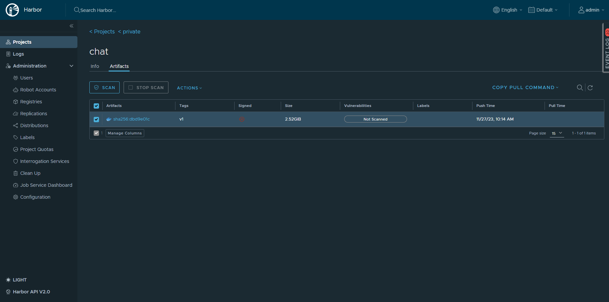

5. When the scan operation is complete, you can easily view the results of the vulnerability scan in the Harbor portal. Look for the `Vulnerabilities` cell, and hover your mouse over it. A histogram will appear, providing a visual representation 

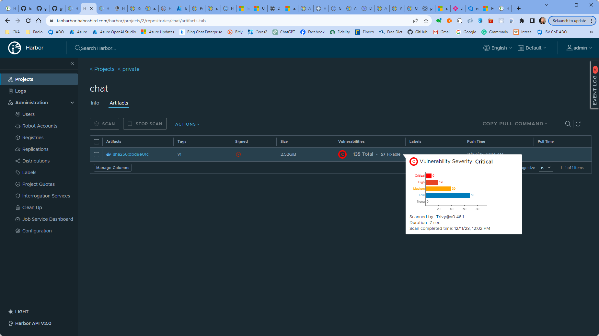

6. If you click the link to open the release, you can see a detailed report of the vulnerabilities found by [Trivy](https://github.com/aquasecurity/trivy).

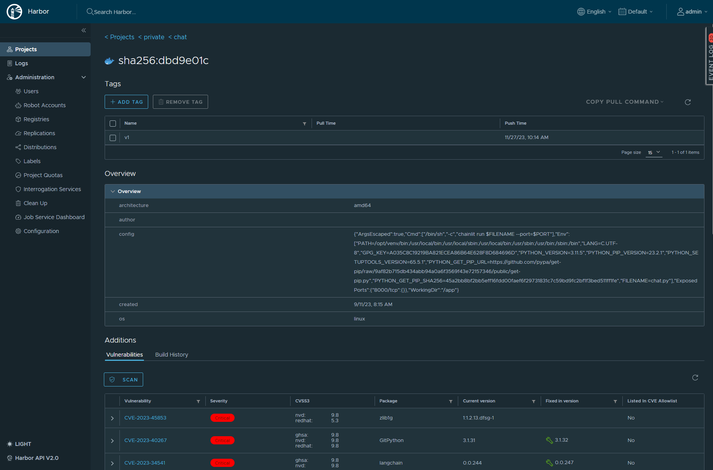

## Configure Harbor Replication Rules using Terraform

The [Terraform Harbor Provider](https://github.com/goharbor/terraform-provider-harbor) can be used to configure an instance of Harbor. The provider needs to be configured with the proper credentials before it can be used.

### Resources

The Terraform Harbor Provider supports the following resources:

- [Resource: harbor_configuration](https://github.com/goharbor/terraform-provider-harbor/tree/main/docs/resources/configuration.md)
- [Resource: harbor_config_system](https://github.com/goharbor/terraform-provider-harbor/tree/main/docs/resources/config_system.md)
- [Resource: harbor_config_email](https://github.com/goharbor/terraform-provider-harbor/tree/main/docs/resources/config_email.md)
- [Resource: harbor_garbage_collection](https://github.com/goharbor/terraform-provider-harbor/tree/main/docs/resources/garbage_collection.md)
- [Resource: harbor_purge_audit_log](https://github.com/goharbor/terraform-provider-harbor/tree/main/docs/resources/purge-audit-log.md)
- [Resource: harbor_immutable_tag_rule](https://github.com/goharbor/terraform-provider-harbor/tree/main/docs/resources/immutable_tag_rule.md)
- [Resource: harbor_interrogation_services](https://github.com/goharbor/terraform-provider-harbor/tree/main/docs/resources/interrogation_services.md)
- [Resource: harbor_label](https://github.com/goharbor/terraform-provider-harbor/tree/main/docs/resources/label.md)
- [Resource: harbor_project_member_group](https://github.com/goharbor/terraform-provider-harbor/tree/main/docs/resources/project_member_group.md)
- [Resource: harbor_project_member_user](https://github.com/goharbor/terraform-provider-harbor/tree/main/docs/resources/project_member_user.md)
- [Resource: harbor_project](https://github.com/goharbor/terraform-provider-harbor/tree/main/docs/resources/project.md)
- [Resource: harbor_registry](https://github.com/goharbor/terraform-provider-harbor/tree/main/docs/resources/registry.md)
- [Resource: harbor_replication](https://github.com/goharbor/terraform-provider-harbor/tree/main/docs/resources/replication.md)
- [Resource: harbor_retention_policy](https://github.com/goharbor/terraform-provider-harbor/tree/main/docs/resources/retention_policy.md)
- [Resource: harbor_robot_account](https://github.com/goharbor/terraform-provider-harbor/tree/main/docs/resources/robot_account.md)
- [Resource: harbor_tasks](https://github.com/goharbor/terraform-provider-harbor/tree/main/docs/resources/tasks.md)
- [Resource: harbor_user](https://github.com/goharbor/terraform-provider-harbor/tree/main/docs/resources/user.md)

### Authentication

You can configure the Terraform Harbor Provider with credentials as follows:

```hcl
provider "harbor" {
  url      = "https://harbor.aceme_corpartion.com"
  username = "insert_admin_username_here"
  password = "insert_password_here"
}
```

Alternatively, these environment variables can be used to set the provider config values:

```bash
HARBOR_URL
HARBOR_USERNAME
HARBOR_PASSWORD
HARBOR_IGNORE_CERT
```

### Argument Reference

The following arguments are supported:

- `url` - (Required) The url of harbor
- `username` - (Required) The username to be used to access harbor
- `password` - (Required) The password to be used to access harbor
- `insecure` - (Optional) Choose to ignore certificate errors
- `api_version` - (Optional) Choose which version of the api you would like to use 1 or 2. Default is `2`

### Links

For more information, see the following resources:

- [Terraform Harbor Provider](https://github.com/goharbor/terraform-provider-harbor)
- [Harbor Terraform Provider GitHub repository](https://github.com/nolte/terraform-provider-harbor)
- [Harbor Terraform Provider Documentation](https://registry.terraform.io/providers/nolte/harbor/latest/docs)
- [Harbor Multi Datacenter With Replicated Artifacts](https://www.unix-experience.fr/en/devops/harbor_multidc_replicated/)

## Using Harbor in CI/CD

Harbor can serve as a centralized hub and a single source of truth for hosting container images and OCI artifacts, such as Helm charts, in a CI/CD workflow. Whether you are leveraging [Azure DevOps](https://learn.microsoft.com/en-us/azure/devops/user-guide/what-is-azure-devops?view=azure-devops) or [GitOps](https://www.weave.works/technologies/gitops/) technologies like [Argo CD](https://argo-cd.readthedocs.io/en/stable/) and [Flux CD](https://fluxcd.io/), Harbor offers seamless integration and ensures the reliability and consistency of your deployment process.

### GitOps and DevOps

GitOps and DevOps are two popular methodologies for managing software development and deployment processes.

- `GitOps` is an approach where the desired state of infrastructure and applications is declared and version-controlled in a Git repository. Tools such as [Argo CD](https://argo-cd.readthedocs.io/en/stable/) and [Flux](https://fluxcd.io/) continuously monitor the repository and automatically synchronize the actual state of the system with the desired state defined in the repository. This ensures a declarative and auditable approach to software delivery and deployment.
- `DevOps`, on the other hand, is a set of practices that combines software development and IT operations. It emphasizes collaboration, automation, and continuous delivery of software changes. DevOps methodologies promote shorter development cycles, faster feedback loops, and improved collaboration between development teams and operations teams.

### Harbor Integration in CI/CD Workflows

Harbor seamlessly integrates with Azure DevOps or GitOps technologies like [Argo CD](https://argo-cd.readthedocs.io/en/stable/) and [Flux](https://fluxcd.io/) , enabling smooth workflows for managing container images. By utilizing Harbor as a container registry, you can store and version your container images in a secure and centralized location. This ensures consistent access to the required images across different stages of your CI/CD pipeline. 
With Azure DevOps, you can easily configure your build pipelines to push the container images to Harbor. By making Harbor the authoritative source for your container images, you can ensure that all stages of your pipeline use the same trusted images.

Similarly, when utilizing GitOps technologies like Argo CD or Flux, you can configure those tools to pull the container images from Harbor for deployment. This ensures that the deployed environments match the desired state defined in your Git repository. By leveraging Harbor's capabilities as a single source of truth for container images, you can enhance the reliability, traceability, and security of your CI/CD workflows, regardless of whether you are using Azure DevOps or GitOps methodologies.

### Using Harbor with Argo CD

The following diagram shows how Harbor integrates with Argo CD:

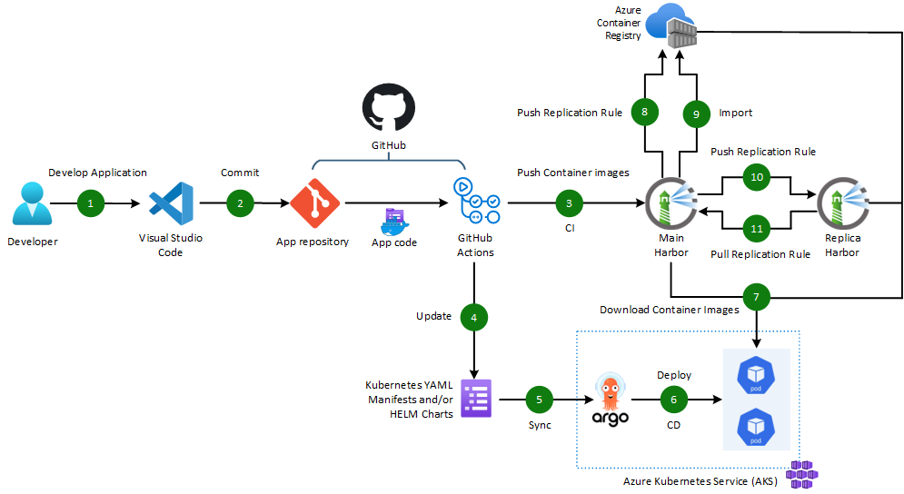

In this scenario, we establish a pull-based DevOps pipeline to deploy an application using [Argo CD](https://argo-cd.readthedocs.io/en/stable/), [Harbor](https://goharbor.io/), and [GitHub Actions](https://docs.github.com/en/actions). The pipeline is designed to pull YAML manifests or Helm charts from a Git repository and container images from the main Harbor registry. Alternatively, it can also fetch container images from an [Azure Container Registry (ACR)](https://azure.microsoft.com/en-us/services/container-registry/) or a secondary Harbor instance that is synchronized with the main Harbor. Let's take a look at the data flow:

1. The application code is developed using a popular integrated development environment (IDE) like Visual Studio Code.
2. The code is then committed to a Git repository hosted on GitHub or any other distributed version control system.
3. The [GitHub Actions](https://docs.github.com/en/actions) CI pipeline is configured to build a container image from the application code and push it to a Harbor registry used as a single source of truth.
4. As part of the continuous integration process, [GitHub Actions](https://docs.github.com/en/actions) updates a Kubernetes YAML manifest or Helm chart with the latest version of the container image, based on the image version in Harbor.
5. The [Argo CD](https://argo-cd.readthedocs.io/en/stable/) operator provides seamless monitoring of the Git repository for any configuration changes. It automatically detects any changes and efficiently pulls the updated YAML manifests or Helm charts. As a result, Argo CD effortlessly deploys the new application release onto the AKS cluster, ensuring smooth and timely updates.
6. [Argo CD](https://argo-cd.readthedocs.io/en/stable/), acting as the GitOps operator, leverages the YAML manifest or Helm charts to deploy the web application to an AKS cluster.
7. During the deployment process, the container images are directly pulled from the primary Harbor instance. Alternatively, the container images can be pulled from a Harbor replica, or an [Azure Container Registry (ACR)](https://azure.microsoft.com/en-us/services/container-registry/).
8. The main Harbor instance also pushes container images to an [Azure Container Registry (ACR)](https://azure.microsoft.com/en-us/services/container-registry/) for wider distribution and consumption.
9. Alternatively, [Azure Container Registry (ACR)](https://azure.microsoft.com/en-us/services/container-registry/) can be configured to import the container images from Harbor, ensuring they are readily available in the registry.
10. In a distributed Harbor setup, the main Harbor instance pushes container images to a replica Harbor instance.
11. Alternatively, the secondary Harbor instance pulls container images directly from the main Harbor instance to maintain consistency.

### Using Harbor with Flux

The following diagram shows how Harbor integrates with Flux:

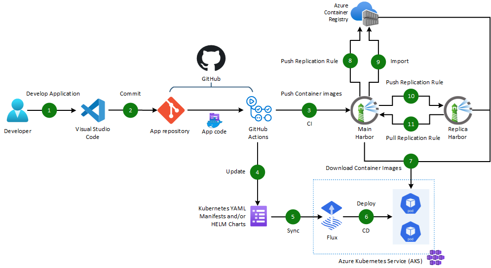

In this scenario, we establish a pull-based DevOps pipeline to deploy an application using [Flux](https://fluxcd.io/), [Harbor](https://goharbor.io/), and [GitHub Actions](https://docs.github.com/en/actions). The pipeline is designed to pull YAML manifests or Helm charts from a Git repository and container images from the main Harbor registry. Alternatively, it can also fetch container images from an [Azure Container Registry (ACR)](https://azure.microsoft.com/en-us/services/container-registry/) or a secondary Harbor instance that is synchronized with the main Harbor. Let's take a look at the data flow:

1. The application code is developed using a popular integrated development environment (IDE) like Visual Studio Code.
2. The code is then committed to a Git repository hosted on GitHub or any other distributed version control system.
3. The [GitHub Actions](https://docs.github.com/en/actions) CI pipeline is configured to build a container image from the application code and push it to a Harbor registry used as a single source of truth.
4. As part of the continuous integration process, [GitHub Actions](https://docs.github.com/en/actions) updates a Kubernetes YAML manifest or Helm chart with the latest version of the container image, based on the image version in Harbor.
5. The [Flux](https://fluxcd.io/) operator provides seamless monitoring of the Git repository for any configuration changes. It automatically detects any changes and efficiently pulls the updated YAML manifests or Helm charts. As a result, Flux effortlessly deploys the new application release onto the AKS cluster, ensuring smooth and timely updates.
6. [Flux](https://fluxcd.io/), acting as the GitOps operator, leverages the YAML manifest or Helm charts to deploy the web application to an AKS cluster.
7. During the deployment process, the container images are directly pulled from the primary Harbor instance. Alternatively, the container images can be pulled from a Harbor replica, or an [Azure Container Registry (ACR)](https://azure.microsoft.com/en-us/services/container-registry/).
8. The main Harbor instance also pushes container images to an [Azure Container Registry (ACR)](https://azure.microsoft.com/en-us/services/container-registry/) for wider distribution and consumption.
9. Alternatively, [Azure Container Registry (ACR)](https://azure.microsoft.com/en-us/services/container-registry/) can be configured to import the container images from Harbor, ensuring they are readily available in the registry.
10. In a distributed Harbor setup, the main Harbor instance pushes container images to a replica Harbor instance.
11. Alternatively, the secondary Harbor instance pulls container images directly from the main Harbor instance to maintain consistency.

### Using Harbor with Azure DevOps

The following diagram shows how Harbor integrates with Azure DevOps:

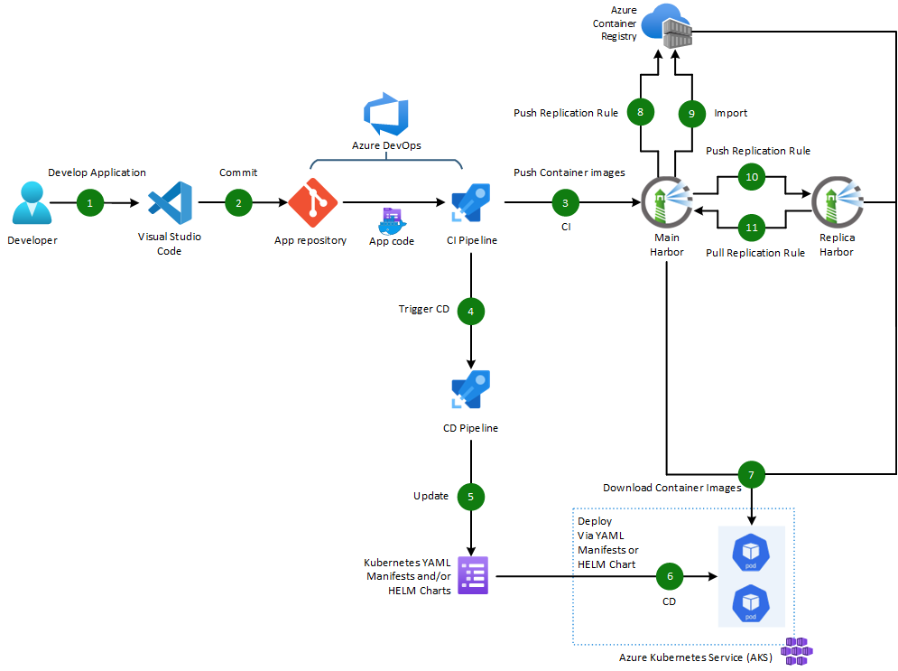

In this scenario, we establish a push-based DevOps pipeline to deploy an application using [Azure DevOps](https://learn.microsoft.com/en-us/azure/devops/user-guide/what-is-azure-devops?view=azure-devops) and [Harbor](https://goharbor.io/). The CI/CD pipelines are designed to deploy YAML manifests or Helm charts from a Git repository and pull container images from the main Harbor registry. Alternatively, the YAML manifests and Helm charts can be configured to fetch container images from an [Azure Container Registry (ACR)](https://azure.microsoft.com/en-us/services/container-registry/) or a secondary Harbor instance that is synchronized with the main Harbor. Let's take a look at the data flow:

1. The application code is developed using a popular integrated development environment (IDE) like Visual Studio Code.
2. The code is then committed to a Git repository hosted on GitHub or any other distributed version control system.
3. The [Azure DevOps](https://learn.microsoft.com/en-us/azure/devops/user-guide/what-is-azure-devops?view=azure-devops) CI pipeline is configured to build a container image from the application code and push it to a Harbor registry used as a single source of truth.
4. The successful completion of the CI pipeline triggers the execution of the CD pipeline
5. The CD pipeline updates a Kubernetes YAML manifest or Helm chart with the latest version of the container image, based on the image version in Harbor.
6. The CD pipeline deploys the new application release to the AKS cluster using YAML manifests or Helm charts.
7. During the deployment process, the container images are directly pulled from the primary Harbor instance. Alternatively, the container images can be pulled from a Harbor replica, or an [Azure Container Registry (ACR)](https://azure.microsoft.com/en-us/services/container-registry/).
8. The main Harbor instance also pushes container images to an [Azure Container Registry (ACR)](https://azure.microsoft.com/en-us/services/container-registry/) for wider distribution and consumption.
9. Alternatively, [Azure Container Registry (ACR)](https://azure.microsoft.com/en-us/services/container-registry/) can be configured to import the container images from Harbor, ensuring they are readily available in the registry.
10. In a distributed Harbor setup, the main Harbor instance pushes container images to a replica Harbor instance.
11. Alternatively, the secondary Harbor instance pulls container images directly from the main Harbor instance to maintain consistency.

## Using Harbor in multi-cloud scenario

In a multi-cloud scenario, a primary Harbor instance can serve as the central repository and single source of truth for container images and OCI artifacts, including Helm charts. To achieve this, replication rules can be utilized to export these artifacts to one or more Harbor replica instances hosted in separate cloud platforms.

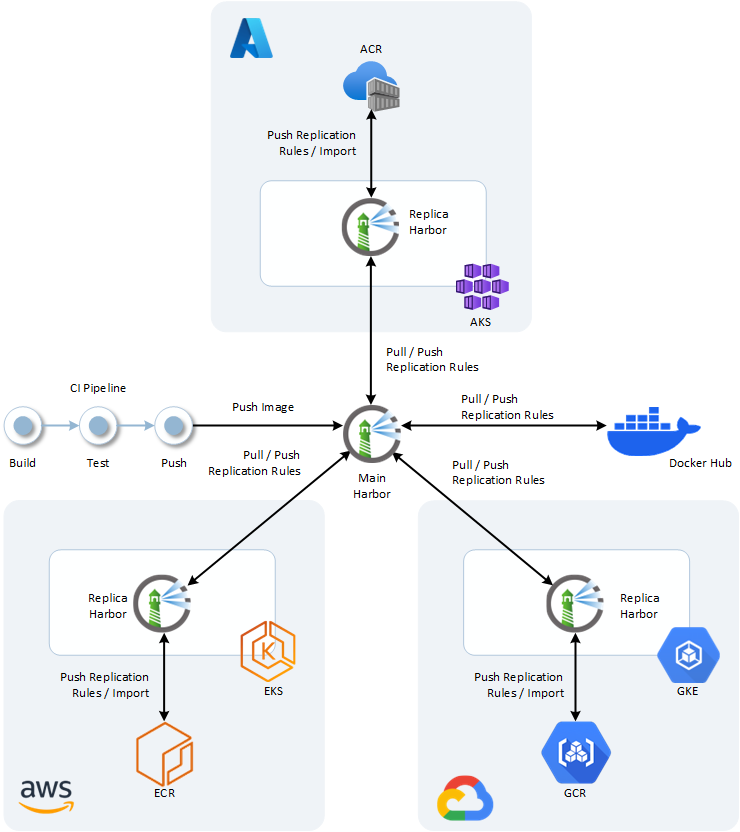

To ensure secure and private communication channels across different cloud environments, Virtual Private Network (VPN) connections can be established between the cloud platforms. This facilitates the secure transfer of artifacts between different Harbor instances. The main CI pipeline of the DevOps system can be configured to push container images to the primary Harbor instance. From there, these artifacts can be replicated to cloud-specific Harbor replica instances hosted by managed Kubernetes in one or multiple regions for best performance and resiliency. Harbor replica instances can be eventually configured to replicate OCI artifacts to one or more managed container registries such as [Azure Container Registry (ACR)](https://azure.microsoft.com/en-us/services/container-registry/), [AWS Elastic Container Registry (ECR)](https://aws.amazon.com/ecr/), or [Google Container Registry (GCR)](https://cloud.google.com/container-registry).

When deploying applications on cloud platforms like [Azure Kubernetes Service (AKS)](https://learn.microsoft.com/en-us/azure/aks/intro-kubernetes), [Amazon Elastic Kubernetes Service (EKS)](https://docs.aws.amazon.com/eks/latest/userguide/what-is-eks.html), or [Google Kubernetes Engine (GKE)](https://cloud.google.com/kubernetes-engine), YAML manifests or Helm charts can pull the required container images either from local Harbor installations or from cloud-specific managed container registries. By leveraging the primary Harbor instance as the single source of truth, organizations can ensure consistency and reliability in their multi-cloud CI/CD pipelines, while taking advantage of cloud-specific container registry capabilities. This approach enhances flexibility, security, and portability across different cloud environments.

## Conclusion

With Harbor as their container registry, customers enjoy the benefits of consistent, secure, and streamlined container image management. The advantages of using Harbor extend beyond a single cloud provider, providing customers with the flexibility to leverage multiple cloud environments without sacrificing operational efficiency or security. By adopting Harbor, customers can confidently navigate their multi-cloud Kubernetes infrastructure while reaping the rewards of simplified operations and enhanced security. To learn more about Harbor and its capabilities, visit the [Harbor website](https://goharbor.io/) and explore the vast resources available within the CNCF community.

## Acknowledgements

I would like to express my gratitude to [Michael C. Bazarewsky](https://github.com/MikeBazMSFT) and [Shankar Ramachandran](https://github.com/shankar-r10n) for reviewing the article and for providing valuable suggestions. Thank you for your time and expertise.
